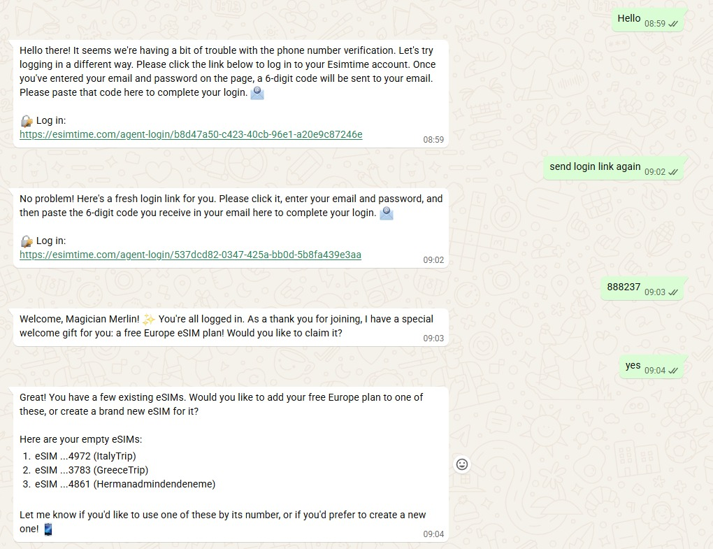
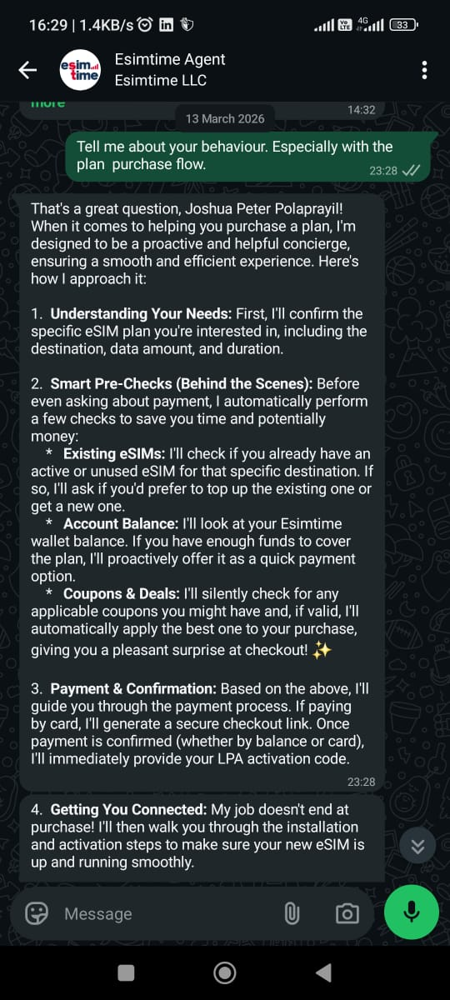
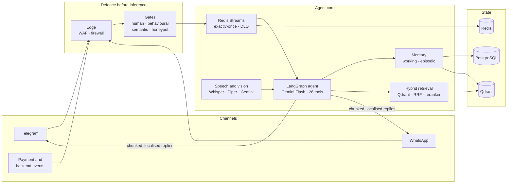
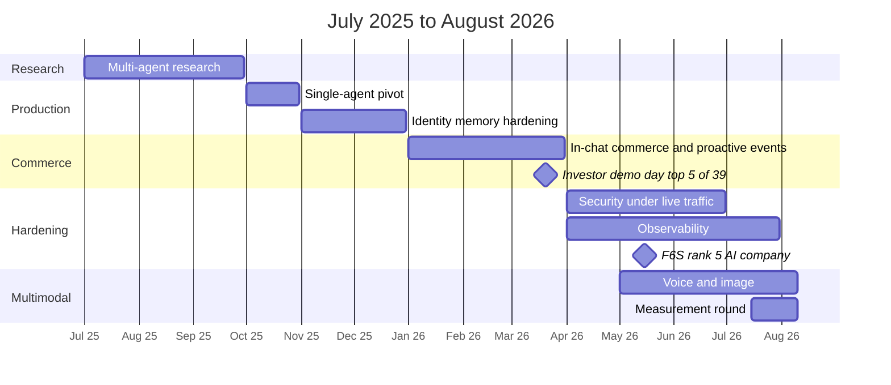

# Building a Transaction-Capable AI Agent Before There Was a Playbook

### Engineering field notes from thirteen months of production agentic AI — CPU-only, under $45/month

  <strong>Joshua Peter Polaprayil</strong> · Full-Stack AI Engineer 
  <em>AI · Commerce · Retrieval · Security · Infrastructure</em>

---

> **Scope** · A production case study of a system that served real customers. Architecture, trade-offs, measurements and failures are documented in full. Source code is not included.

> [!IMPORTANT]
> **Status note.** I designed, built and operated this platform from July 2025 until my handover in August 2026. This document describes the system as it stood at that point — a snapshot, not a live record. I no longer maintain the platform or hold access to it, and nothing here should be read as describing its current state.
>
> The handover included full documentation, a directory of every open item, and an explicit list of what was shipped versus what was scoped but not started. The items that were still open are described in [Known Limitations](docs/07-reflections.md#known-limitations), as they stood at handover.

---

## A Note Before You Read

When I started this work in July 2025, transaction-capable autonomous agents — agents that hold state, manage identity, and complete a purchase end to end — were not yet a commercial category.

The public timeline bears that out. OpenAI's in-chat checkout, Instant Checkout, launched on 29 September 2025. Google unveiled its Universal Commerce Protocol for agentic shopping on 11 January 2026. Through the first quarter of 2026, this agent went live provisioning eSIMs and taking payments from real customers inside WhatsApp and Telegram.

The more interesting fact isn't "early". OpenAI wound Instant Checkout down in March 2026, around five months after launch: only about a dozen Shopify merchants had gone live, and Walmart reported that purchases completed inside ChatGPT converted at roughly a third of the rate of click-through. This system is a different scale and a different vertical — a focused eSIM concierge, not a general marketplace — so the comparison isn't "this beat that". It's narrower and more useful. A purchase journey that starts, confirms and completes inside the conversation — wallet payments settling in the thread, card payments through a hosted checkout link, the activation code delivered back into the chat — was still running here at handover in August 2026 — having weathered a steady stream of forced backend changes that repeatedly broke it and had to be re-integrated, along with the components around it — while a far larger implementation of a similar pattern had already been walked back.

That gap is why this document exists. The core problems here — exactly-once proactive delivery, cross-platform identity resolution, intent preservation across authentication boundaries, prompt-injection defence inside the request path — had to be solved from first principles, because there was no reference implementation to borrow from. Some of it would be built differently today with tooling that now exists. That's the point. These are field notes from before the playbook.

**What this is:** an architectural and engineering case study of a production system I designed, built and operated — written as a technical narrative. What I tried, what broke, what I measured, what I chose instead.

**What this is not:** an implementation guide. No source code, business logic, schemas or credentials appear here. Security thresholds are given where they're instructive, because the defensive design is meant to be reusable.

---

## TL;DR

A production AI agent handling the complete eSIM customer lifecycle — discovery, authentication, payment, provisioning, activation, troubleshooting — autonomously, inside WhatsApp and Telegram, in text, voice and images.

| | |
|---|---|
| **Response time** | **P50 9.3s** · P90 20.7s over a 7-day production window — dominated by LLM output tokens, see [Performance](docs/06-performance.md) |
| **Voice round-trip** | **P50 7.7s** across 8 production traces, down from 24–28s after a measurement-driven optimisation round |
| **Tool accuracy** | **>99%** across the integration suite, 26 schema-validated tools |
| **Under adversarial load** | **19,164** malicious payloads absorbed at **319 RPS** while legitimate traffic held **100% success** (bench, pre-multimodal) |
| **Injection classification** | p50 **23.8ms** · p95 32.2ms — INT8 on CPU, inline in the request path |
| **Webhook ingest** | median 5ms · p95 9ms · p99 14ms · 100% delivery (bench) |
| **System prompt** | **82%** token compression with no measured behaviour loss; ~15k-token static prefix served from an explicit cache |
| **Testing** | 159 unit and contract tests · 49 LLM-judged journey scenarios · a live end-to-end driver with nothing mocked |
| **Observability** | 51 application metrics · ~120-panel operator dashboard · 8 alert rules as code |
| **Languages** | Agent mirrors the user's language · system text in 10 locales incl. RTL · speech voice map covers 32 languages |
| **Hardware** | One 8 vCPU CPU-only VPS — no GPU, anywhere |
| **Running cost** | **~$11–45/month** all-in at handover, against $300–500+ for a managed-cloud equivalent — trending upward since, as both the LLM provider and the VPS host have raised or signalled price rises |
| **Recognition** | **#5 AI company on [F6S](https://www.f6s.com/companies/artificial-intelligence/united-states/wyoming/sheridan/co)** (May 2026, ranked across 2M+ startups) · **Top 5 of 39** at an investor demo day |

**The model set, all on CPU:** three INT8 ONNX models in the request path — Meta's Llama Prompt Guard 2 for injection classification, a multilingual NER model for PII detection, and a cross-encoder reranker — plus self-hosted speech (faster-whisper at int8 and Piper TTS) and an offline-trained XGBoost risk classifier exported to ONNX.

  

  
  

<em>Not staged: the live operator dashboard, the login relay on the production domain, and the agent describing its own design when asked. Dashboard panels reflect their own time windows; the measured 7-day figures are in <a href="docs/06-performance.md">Performance</a>.</em>

---

## Architecture at a Glance

The full component diagram is in [System Architecture](docs/05-architecture.md#system-architecture); every defence layer is mapped in the [Security Deep Dive](docs/09-security-architecture.md#3-the-layer-map).

---

## Evolution at a Glance

| | Research (Phase 1) | Production pivot (Phases 2–3) | At handover (Phases 4–7) |
|---|---|---|---|
| **Architecture** | Three coordinating agents | Single agent, six-node graph, two LLM calls per turn | Single agent, two-node loop, one LLM call per step · commerce · proactive events |
| **LLM** | LLaMA 3.1 8B, local | Gemini Flash | Gemini 2.5 Flash — successor evaluated, not yet decided |
| **Context** | 128k | 1M | 1M |
| **Vector store** | In-memory | Qdrant, persistent | Qdrant, native server-side hybrid |
| **Auth** | Basic sessions | OTP + cross-platform identity | Web-link login relay · billing identity |
| **Memory** | Conversation only | Episodic + semantic | Episodic + semantic, PII-scrubbed |
| **Commerce** | — | — | Checkout, wallet balance, free trials |
| **Notifications** | — | — | Exactly-once, dead-letter queue, pending store |
| **Modality** | Text | Text | Text, voice, image |
| **Security** | — | Rate limits, encryption | Ten defence layers, ML-classified, load-tested |
| **Tools** | ~5 | 15+ | 26 |
| **Response time** | 8–12s | 3–5s (text-only stack) | P50 9.3s (multimodal stack, production) |

---

## The Case Study

An engineering narrative, split by theme. Start anywhere — each part stands on its own.

| | Part | What's in it |
|---|---|---|
| **01** | [**Timeline — Seven Phases**](docs/01-timeline.md) | The brief, the constraint that shaped every decision, and seven phases from multi-agent research prototype to transaction-capable production agent. |
| **02** | [**Platform Constraints**](docs/02-platform.md) | Message delivery and localisation, the platform limits you can't engineer around, the boot loop, and a measured memory model for running speech and classifiers under a fixed RAM ceiling. |
| **03** | [**Models, Temperature & Attention**](docs/03-models.md) | A 24-run model evaluation, why the decision stayed open, and the wrong-product-ID failure that no prompt or temperature setting could fix. |
| **04** | [**Evaluation, Testing & Delivery**](docs/04-engineering.md) | Offline MLOps, the test layers, contract tests for silent drift, the incident that redefined "tested", and the delivery pipeline. |
| **05** | [**System Architecture**](docs/05-architecture.md) | The agent loop, the sixteen-section system prompt, hybrid retrieval, the data layer, and the full technology stack. |
| **06** | [**Performance & Economics**](docs/06-performance.md) | Measured latency across the whole request path, with provenance, and the cost breakdown behind running all of it for under $45 a month. |
| **07** | [**Limitations, Next Steps & Lessons**](docs/07-reflections.md) | What was still open at handover, the prioritised work that came next, how the system is governed, and what I'd tell someone starting this today. |

**Deep dives, outside the seven-part narrative:**

| | Deep dive | What's in it |
|---|---|---|
| **08** | [**Research Notes**](docs/08-research-notes.md) | Two experimental prototypes of published agentic techniques — a hierarchical plan–execute–reflect agent and an LLM-synthesised memory closer to Mem0 — presented as concepts, with their structural costs. |
| **09** | [**Security Architecture**](docs/09-security-architecture.md) | Ten defence layers in full: the human gate, behavioural and semantic gates, honeypot, agent-initiated flagging, leakage-safe ML risk scoring, PII and encryption design, and the adversarial load test. |

---

## Ideas Worth Taking

The patterns from this project I'd reuse anywhere, each documented in depth.

| Idea | In one line | Where |
|---|---|---|
| **Phantom login** | Queue the request that needed auth, detect the login, execute it — the user asks once | [01](docs/01-timeline.md#phase-3--identity-memory-hardening-novdec-2025) |
| **Resolve the fact before the model describes it** | Mint the login link *before* generating the message that promises one | [01](docs/01-timeline.md#phase-3--identity-memory-hardening-novdec-2025) |
| **Validate selections against what was shown** | A purchase is refused unless the product ID and price match what this user was just shown | [03](docs/03-models.md#temperature-attention-and-the-wrong-product-id) |
| **Temperature fixes fabrication, not selection** | Two identical-looking failures, two completely different fixes | [03](docs/03-models.md#temperature-attention-and-the-wrong-product-id) |
| **Contract tests for silent drift** | Prompt vs toolset, training vs inference, score vs threshold | [04](docs/04-engineering.md#contract-tests-for-the-drift-nothing-else-catches) |
| **Tested is not verified** | A path is verified only when run against the real system *and* the resulting state is re-read | [04](docs/04-engineering.md#the-incident-that-redefined-tested) |
| **Retrieval on demand, not on every turn** | Don't pay reranking latency on greetings and balance checks | [05](docs/05-architecture.md#retrieval-architecture) |
| **Size to the recycle peak** | Measure shared vs per-worker memory; plan for N+1 workers during restarts | [02](docs/02-platform.md#the-measured-memory-model) |
| **Crawlers consume single-use links** | Serve link-preview bots a decoy before they spend the user's verification | [09](docs/09-security-architecture.md#5-the-human-gate) |
| **Silence for adversaries, clarity for customers** | One notice a day when suspended; nothing at all when banned | [09](docs/09-security-architecture.md#6-the-behavioural-gate--userguard) |
| **Deny the model the label's inputs** | A risk classifier trained on the columns its labels come from learns nothing — and scores brilliantly | [09](docs/09-security-architecture.md#11-ml-risk-scoring) |
| **Ask your dashboards a question** | Executing every panel's query found 48 of 61 targets silently empty | [01](docs/01-timeline.md#the-dashboards-were-lying-and-i-only-found-out-by-asking-them) |

---

## Recognition

**F6S ranking — May 2026.** Reached **#5 AI company** on F6S, a platform that ranks across a base of 2M+ startups globally — [listing](https://www.f6s.com/companies/artificial-intelligence/united-states/wyoming/sheridan/co). F6S reshared the announcement to its own audience.

**Investor demo day — March 2026.** The company presented at a competitive startup demo day and placed **Top 5 of 39**, with the autonomous agent highlighted as the key product differentiator.

**Founder's public acknowledgement.** On the F6S announcement, the company's founder and CEO publicly thanked the team specifically for the work to keep the platform secure, and — with characteristic humour — thanked the attackers whose constant probing amounted to a continuous free penetration test that made the system's security stronger. That the *live-attack-hardening* story documented in the [security deep dive](docs/09-security-architecture.md) is corroborated in the founder's own public words, rather than only my account, is the part I'd point a sceptical reader to. Beyond security, the whole system — the agent, its flows, the retrieval layer, and the shipped features — was publicly exercised and verified as working by the company, whose feedback let me improve, develop and correct faster; that tight loop was itself a real boost to development.

**Production track record.** In production on two messaging channels from late 2025, with in-chat commerce live from Q1 2026 through to handover.

---

## My Role

I owned the full technical surface of the AI platform — as sole AI engineer and architect, alongside a separate in-house team responsible for the company's core backend and frontend. There is no layer of the agent platform I didn't design, build, break, and repair.

**AI & Machine Learning** — LangGraph agent architecture and state design; hybrid retrieval including fusion strategy, reranking, chunking and knowledge-base engineering; system prompt architecture and measured compression across iterative passes; explicit prompt caching; ONNX inference pipelines for reranking, injection classification and NER; an offline risk classifier with leakage-safe features and promotion gates; a self-hosted speech pipeline with benchmark-driven model selection; an LLM-as-judge harness for testing, model selection and production quality review.

**Full-Stack Engineering** — FastAPI async backend and API design; PostgreSQL schema design with time-ordered keys, migrations and pooling; Redis distributed locking, stream consumer groups, sliding-window rate limiting and Bloom filters; Qdrant collection management, hybrid search and multi-worker indexing coordination; Stripe integration across the full lifecycle; dual-channel Telegram and WhatsApp delivery with ten-locale internationalisation.

**Infrastructure & DevOps** — VPS provisioning and OS hardening from bare metal; Docker Compose orchestration and build-time model provisioning; resource modelling from direct measurement; Nginx reverse proxy, TLS, rate limiting and security headers; Cloudflare WAF, Turnstile, DNS and origin security; GitHub Actions CI/CD with artifact-consistent testing, registry publishing and hash-verified deployment; backup and restore tooling; load and adversarial testing; Prometheus, Grafana, Loki and LangSmith observability, with LangSmith tracing in place from day one.

**Security Engineering** — layered defence from edge to request path; behavioural abuse detection with cross-platform ban propagation; semantic injection defence validated under adversarial load; honeypots and timing analysis; validation as an abuse signal; dual-mode encryption with searchable lookup hashing; PII redaction that preserves product signal; incident analysis and iterative hardening; administrative tooling for non-technical operators.

---

## Contact

**Joshua Peter Polaprayil**
Full-Stack AI Engineer · MSc Big Data Analytics & AI (ATU, Ireland)

- **LinkedIn** — [linkedin.com/in/josh33-peter10](https://www.linkedin.com/in/josh33-peter10/)
- **GitHub** — [github.com/JoshPola96](https://github.com/JoshPola96)
- **Email** — [josh19peter96@gmail.com](mailto:josh19peter96@gmail.com)

Open to AI/ML and full-stack AI engineering roles. If you're building production agentic systems and want someone who can own them from architecture through deployment, I'd like to hear from you.

---

## Repository Note

This repository contains **architectural documentation and engineering narrative only**. It includes no source code, credentials, customer data or confidential business data. Company and product names appear solely as factual work history. The security design is documented in depth deliberately, as a contribution to how conversational agents can be defended.

**MIT License** — see [LICENSE](LICENSE).

---

**Last updated:** September 2026
**Status:** Handed over August 2026 — documented as of that date

  <em>Built under constraint. Hardened under fire. Measured, not assumed.</em>

