[&larr; Back to the case study](../README.md)

# Timeline - Seven Phases of Production Agentic AI

*How the system got from a multi-agent research prototype to a transaction-capable production agent, phase by phase.*

---

## Origin & Brief

In July 2025 I was contracted as the sole AI engineer to build a conversational layer on top of an existing eSIM commerce platform. The brief was deliberately open-ended: build an AI agent infrastructure that can handle the full product lifecycle and troubleshooting in-chat, and scale without adding headcount.

I took a research-first path rather than reaching for a managed chatbot platform — starting with a locally-hosted multi-agent setup to validate whether agentic workflows could handle real customer conversation at all, before committing to production infrastructure. That phase produced findings that directly shaped everything after it, including the decision to throw most of it away.

By handover in August 2026, thirteen months in, the same system handled discovery, authentication, purchase, provisioning, proactive post-purchase engagement, multimodal input, and adversarial traffic — autonomously, across two channels, on one CPU box.

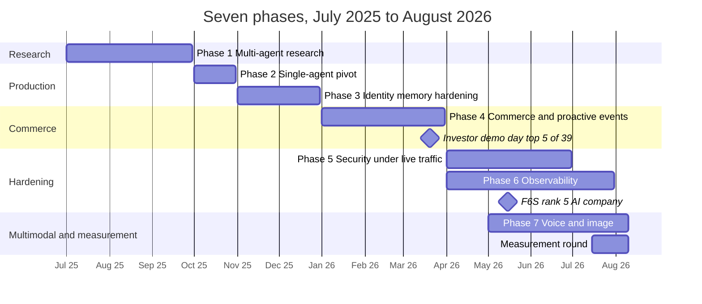

| Period | Phase | Outcome |
|---|---|---|
| Jul–Sep 2025 | 1 · Multi-agent research | Three-agent system validated the premise; latency and context limits identified |
| Oct 2025 | 2 · Production pivot | Collapse to a single agent on Gemini Flash and Qdrant — ~60% latency reduction |
| Nov–Dec 2025 | 3 · Identity, memory, hardening | Cross-platform identity, intent preservation, circuit breakers, CI/CD |
| Jan–Mar 2026 | 4 · Commerce | In-chat purchase, proactive notification pipeline · investor demo day, top 5 of 39 |
| Q2 2026 | 5 · Security | Layered defence under live attack · F6S #5 AI company |
| Q2–Q3 2026 | 6 · Observability | Full metrics, logs, alerting as code, verified dashboards |
| Q2–Q3 2026 | 7 · Multimodal | Self-hosted speech, native vision |
| Q3 2026 | Measurement round | Measured resource model, 24-run model evaluation, prompt caching, auth verified against production |

---

## The Constraint That Shaped Everything

Most published agent architectures assume elastic cloud budget and GPU inference. This one had neither. The entire platform — agent, vector database, every ML model, observability stack — runs on a single commodity CPU box for under $45/month.

That constraint became the most productive design pressure in the project. It closed off brute force at every decision point and forced a discipline I now apply by default: **maximum capability, minimum footprint.**

In practice: every transformer in the request path quantized to INT8 and served through ONNX Runtime on CPU, and speech-to-text run through CTranslate2 at int8, rather than reaching for GPU inference. A two-tier query-embedding cache so repeat queries never touch the network. Retrieval fused server-side in the vector database rather than merged in application code. Speech models chosen by measured RTF-and-RSS trade-off rather than by reaching for the largest available.

The result is a stack where infrastructure overhead is small relative to model inference — not because the hardware is fast, but because nothing in the path is allowed to be wasteful. (Actual production timings, and where they diverge from bench measurements, are in [Performance](06-performance.md#performance).)

I think this is the more interesting engineering problem, and the more transferable one. Anyone can make a system fast with money. Making it fast without any is where the decisions actually live.

---

## Phase 1 — Multi-Agent Research (Jul–Sep 2025)

**Hypothesis:** specialised agents, coordinating.

I started where the literature pointed, and from my prior academic project — a three-agent system (orchestrator, API agent, retrieval agent), running LLaMA 3.1 8B locally via Ollama against an in-memory vector store. It validated the core premise, that agentic workflows could handle genuinely unstructured customer conversation without collapsing.

It was also unusable in production.

**What broke:**

*Handoff latency compounded.* Every agent-to-agent transition cost an inference pass. Response times landed at 8–12 seconds. For a chat interface, that isn't slow — it's broken.

*Context windows couldn't hold the conversation.* At 128k tokens, maintaining coherent state across multi-turn troubleshooting while also carrying retrieved knowledge meant constant lossy truncation. The agent forgot things mid-conversation and users noticed.

*Locally-hosted inference was a dead end.* The quality-to-latency curve on available CPU hardware made it non-viable. A genuine research detour, worth the weeks spent to rule out definitively rather than assume.

**Finding:** multi-agent coordination is a real pattern with real uses. For a single coherent conversational domain it solved a problem I didn't have while creating one I couldn't afford.

**A parallel research excursion, alongside the multi-agent question.** In my own time, separate from what was scoped to ship, I also prototyped a more literal implementation of the Mem0 technique this system cites as inspiration — an LLM-synthesised "biography" of each user, refreshed under a distributed lock, alongside a "scratchpad" that re-derived the current conversational goal and any auth-blocked pending intents fresh on every turn. A genuinely more faithful reading of the cited research than what shipped. Retired anyway, because direct retrieval produces most of the same value as a side effect of a single search call rather than two or three extra model calls — full mechanism, and why, in [Research Notes](08-research-notes.md#ii-the-synthesised-memory-design--and-a-more-faithful-reading-of-mem0).

---

## Phase 2 — The Production Pivot (Oct 2025)

I collapsed three agents into one.

A single agent with a large context window and a rigorously designed tool layer replaced the entire coordination structure. Specialisation moved from *separate agents* into *schema-validated tools* — still specialised, no longer costing a network hop and an inference pass per invocation.

Alongside: migration to Gemini Flash for context capacity and native tool calling — 128k to 1M tokens — and, for retrieval, a migration that turned out to be one of the best calls of the project.

**Result: ~60% latency reduction.** 8–12 seconds became 3–5.

The retrieval stack has its own story, because I worked on it from the very first day and kept refining it to the end. It began as a hand-built hybrid — BM25 with reciprocal-rank fusion and a cross-encoder reranker — on top of Chroma. That validated the approach but left me maintaining a sparse index, its serialisation, and its cross-worker synchronisation by hand. Swapping the vector store to **Qdrant**, chosen because it was natively async and could compute hybrid search server-side, collapsed all of that machinery into the database: sparse and dense vectors, IDF weighting and RRF fusion all became native, and an entire class of multi-worker consistency bug disappeared. It's one of the cleanest retrieval designs I know of running today, and the simplification was the whole point rather than a side effect. The knowledge base itself came from the company's own material — troubleshooting guides, installation steps, operator lists, plan catalogues — converted to Markdown and put through many rounds of ingestion, chunking and tuning, with the embedding model, the reranker and the sparse method all swapped as better options appeared. The full present-day design is in [System Architecture](05-architecture.md#retrieval-architecture). One late refinement had an unlikely trigger: in an interview, an engineer insisted TF-IDF was the state of the art for retrieval. It isn't — BM25 superseded it for search decades ago, fixing exactly its document-length and term-saturation weaknesses — but the exchange sent me back into the literature, and that reading is what led me to drop a separately-run SPLADE step in favour of Qdrant's own native BM25-plus-RRF as the v2 embedders landed. A wrong claim from someone else, checked properly, improved the system.

Embedding and query-vector caching came later, and for a reason worth recording: attackers ran high-volume "mill" traffic specifically to drive up token cost, and caching the embedding work blunted it. That is a recurring theme of this project — several defensive features were shaped by live abuse rather than anticipated in a design doc (see [Phase 5](#phase-5--security-under-live-fire-q2-2026)).

This is the central lesson of the project, and I'll state it plainly: **architectural simplicity outperformed architectural sophistication.** The elegant design lost to the sophisticated one. I've stopped being surprised by that.

**It happened twice.** For several months I developed two versions of the agent in parallel — a single-node "workhorse" agent and a multi-node one — iterating on both at once: improving the same prompt set, finding and fixing the same bugs, and running both through the same complex test cases and scenarios so I could watch them handle identical situations side by side. The multi-node version was a six-node graph — a dedicated context-loading node, an agent node deciding what to call, a token-injection node, the tool executor, a separate post-login handler, and a distinct synthesizer node with its own LLM call converting tool results into the final reply. Two full model calls per turn, minimum: one to decide what to do, a second, separately-configured one to write the answer. The other was the lean single-agent loop that eventually won.

It worked — and, as noted, I built it *alongside* the leaner design rather than before it, comparing the two directly on the same cases. Counter-intuitively, the multi-node version was the easier of the two to get behaving well: segregating tasks across dedicated nodes and two separately-configured LLM instances meant each piece had a narrow job and misbehaved less. Its weakness was the seam between the pieces. To get the final answer right for the user's intent, the synthesizer had to be handed the user query, the decision model's reasoning, the tool set *and* the history anyway — so most of the context was being passed across the seam regardless, creating redundancy rather than removing it, and the prompt set needed to steer that second model kept growing longer and more tangled. The result was a split-brain failure mode: the final-answer model, working from a relayed picture rather than the live one, would routinely write something subtly off from what the conversation actually needed, worst in the early stages and never fully gone even after I committed to the single-agent path. Put bluntly, the single-node prompt read like a whole person; the synthesizer, next to it, seemed dumb.

For a chatbot where latency is a first-class constraint, once you get the single-agent prompt right this is a no-brainer for both UX and efficiency — one model, one pass, the whole picture.

The single-agent version was the opposite: a mess at first, steadied only by many iterations of prompt engineering, and once steady it never looked back. The reason it wins is the reason it was hard: **one LLM gets the entire view of the environment and the problem in a single call** — the full history, the live context, the tool results, the user's actual phrasing — instead of a decision model and a synthesis model each seeing half of it. Once the prompt base matured into a stable backbone, that whole-context view produced answers that were faster, more coherent, and more personalised than the multi-node design's could be.

So this is a genuine design choice, not a verdict. Multi-node architectures are easier to keep from breaking, precisely because they segregate focus — for many problems that governance is worth the extra machinery and the seam risk. For *this* problem, a conversation where one mind needs the whole picture to answer well, the single-LLM approach simply outshone it, once the prompt work was there to hold it steady. In graph terms it collapsed to the two-node loop documented throughout this case study — an agent node and a tool node joined by a conditional router, looping until done — with synthesis folded into the same call that decides the tool calls. Same outcome, half the LLM calls per turn. The three-agent-to-one-agent collapse in Phase 1 → 2 was the visible version of this lesson; this was the quieter second version, one level down, inside the single agent itself — and the more transferable of the two.

---

## Phase 3 — Identity, Memory, Hardening (Nov–Dec 2025)

Two channels, one human being — and, once web login existed, a browser session too. The agent had to know they were all the same person.

**Cross-platform identity resolution.** A unified identity layer links platform accounts to a single internal user identity, so context, history, and authentication state follow the person rather than the channel. Log in on Telegram, continue on WhatsApp.

The hard part isn't the happy path — it's that the same human arrives first as an anonymous guest, on two platforms, sometimes from several devices, and the moment they log in, all of it has to collapse onto one account without ever creating a duplicate or losing history. Resolution happens by three keys tried in order — backend account ID, then email hash, then phone hash — and lands in one of three cases:

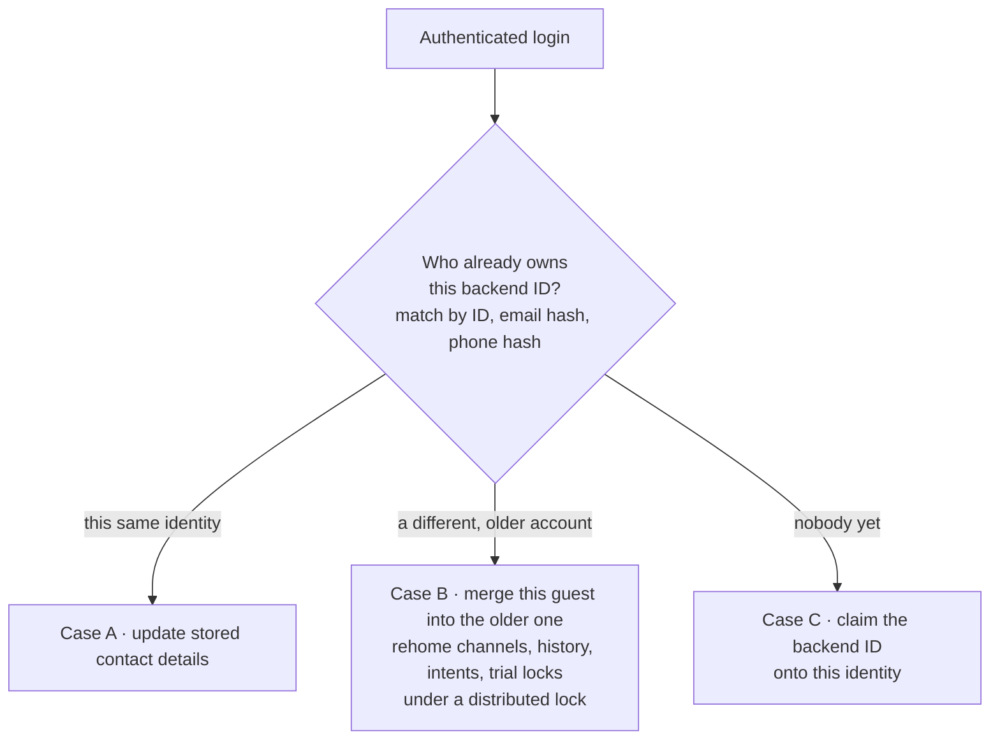

The merge case is the one that earns its complexity. When a guest identity turns out to be someone who already has an account, everything owned by the throwaway — contact channels, conversation history, pending intents, trial locks — is rehomed onto the older account under a per-pair lock, and the guest is retired. **Identity creation is itself lock-guarded**, with a deliberate backstop: if two concurrent first-contact webhooks race past the lock, the database's own uniqueness constraint catches it, and the loser reads back the winner's row rather than surfacing an error. The lock is the fast path; the constraint is the thing that's actually load-bearing. A cache keyed on the hashed identifier — never the raw phone or email — front-runs the lookup, and every cache hit is re-checked against the database before it's trusted, so a stale entry that outlived a cleanup can't resurrect a deleted account. Because identity is modelled as one internal user with many contact channels rather than one-account-per-platform, the same design absorbs new channels almost for free: the web login relay, and any future surface, attach as just another channel on the same user, carrying the same history and entitlements.

**Intent preservation — "phantom login."** My favourite piece of the system, because it's invisible when it works. The naive flow: user asks for their balance → agent requires login → user authenticates → agent says *"You're logged in! What would you like to do?"* That's a UX failure wearing politeness as a disguise.

Instead: the original request is queued as a pending intent, the authentication state change is detected on the next turn, and the queued request executes automatically. The user asks once and gets an answer.

Making that clean required the tool executor to be authentication-aware — detect login calls within a batch, execute them first, refresh session state, inject fresh credentials into the remaining calls, complete the whole set in the same turn.

The friction-free side of this landed with real users in a way the engineering rarely does. In an early design the login was fully passwordless — an OTP dropped straight into the chat and let you in — and the CEO once relayed a customer who had phoned in specifically to say thank you, not for anything clever underneath, but simply because she hadn't had to remember another password. It's a useful reminder that the most advanced-feeling thing to an end user is often the absence of friction, not the presence of sophistication. The irony worth owning: the flow the platform actually settled on is *less* frictionless than that — the current relay sends the user to a web form to enter email and password, which then triggers an email OTP they paste back into the chat. It's more steps than the version that earned the thank-you call, a reminder that security, backend constraints and product direction don't always pull the same way as pure UX, and that the elegant early version isn't always the one that ships.

**Session expiry mid-conversation runs the same machinery in reverse, as a three-tier ladder.** First, try to renew silently: where the session carries a refresh token, spend it *before* tearing anything down, rewrite the failed tool result into "the token was renewed, just call it again", and the user never learns anything happened. Failing that — and this is the common case, since in the later design the backend issued a long-lived 90-day access token and its refresh-token behaviour was inconsistent (removed at one point, reintroduced before I left) — fall back to a mechanism I added that *auto-initiates* the login flow whenever the user's identifying details are already on file, so re-authentication starts itself rather than waiting to be asked. Whichever tier fires, the session is invalidated cleanly — including the session-check debounce cache, so nothing later in the same turn reads stale auth state — before the re-authentication message is composed.

One adjacent pain point was worth solving with plain scripting rather than architecture. During development I sometimes had to drop and rebuild a database, which would have forced every existing user to log in again — a real irritation for the CEO, who was often the one testing, and for the handful of other users on it. So I wrote small scripts that captured and restored user credentials across a rebuild, so returning users stayed logged in. It mattered more than it sounds: there was a genuine rough patch after the live attacks and the F6S recognition, when a reworked authentication flow stayed broken for about three months and took much of the steam and outside interest out of the project even as it kept being developed and improved.

The lesson I'd draw from that stretch is about momentum, not auth. When a product earns a wave of interest, capitalise on it and stay agile — don't let a large speculative rework stall the very momentum you just won. Changes, tests, feedback, and design choices should be grounded in practicalities and agreed by everyone involved before the platform is rebuilt around them; the strongest solution is usually the elegant one that a few minor adaptations of the existing design can deliver, not the total rework that has to justify itself from scratch. You want the product to take off, not crash and burn while a redesign proves a point.

The ordering in that last step is the subtle part, and I got it wrong first time. **Open the new login relay *before* generating the user-facing message**, not after. Otherwise the agent says *"I'll send you a login link"* and then has to produce one that doesn't exist yet. Resolve the fact, then let the model describe it — never the reverse.

The inverse principle mattered just as much: the agent is *led by* the API response, so it should be handed as much of that response as possible — especially on errors. A tool that fails with a specific message about a wrong parameter or a bad type lets the model self-correct on the next turn; an error that surfaces enough detail lets it choose a different UX path, recover, or adapt the journey rather than dead-end. I made a point of giving the LLM maximum information exactly where most systems hide it — in failures and raw responses — because that is what makes the model nuanced instead of brittle, and the answers personalised instead of canned. Put plainly: the API messages and responses returned to the agent have to be informative *for the agent*, and getting that right is a real game-changer for the UX and the overall experience.

**For context, an earlier design.** Authentication was rebuilt three times across the engagement — credentials-in-chat, then OTP-in-chat, then the browser-based relay — and each redesign meant rebuilding the agent-side integration from scratch, often adapting to a backend-side change discovered by hitting it in production rather than by advance notice. That churn is itself the argument for the defensive posture the rest of this case study takes: version the observed contract, verify against the wire, and keep the agent's own layer resilient to an upstream that moves. Before the relay existed, the agent asked for email, phone, and (briefly) a password directly in the chat thread — functional, and exactly the trust problem described above. Shown here with a fabricated test identity, end to end through to a real LPA activation code, purely to illustrate what the current relay replaced:

  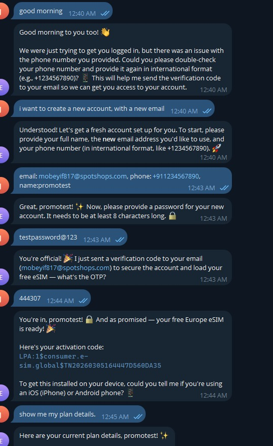
   
  <em>Superseded design, kept for contrast — not the current flow. Test identity throughout.</em>

  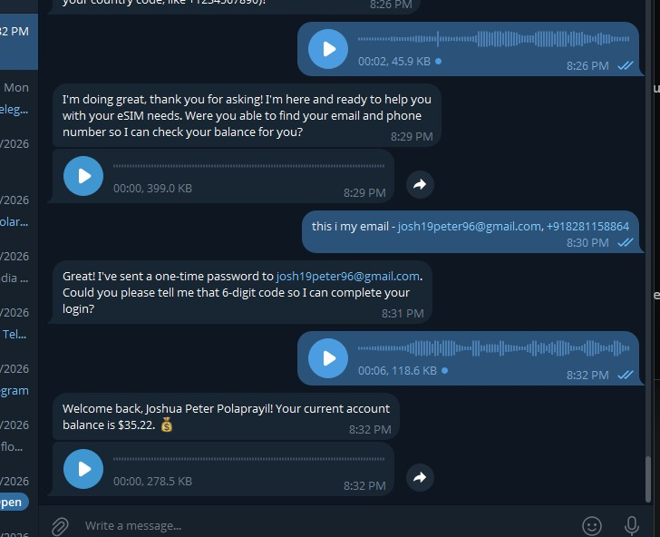
   
  <em>Same superseded design, over voice. The credentials-in-chat step is exactly what the relay above exists to remove.</em>

Throughout, the original failed request stays queued as a pending intent, so whichever rung of the ladder the user comes back on, their request executes automatically.

  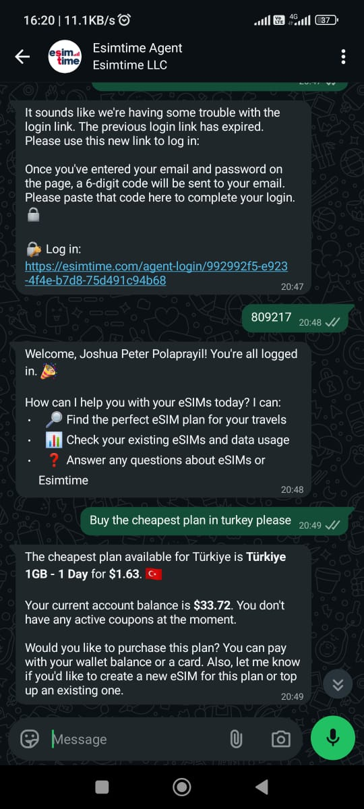
   
  <em>The relay in practice — an expired link is handled by issuing a fresh one, not by leaving the user stuck.</em>

**Interrupted messages have to survive, with their modality intact.** When a user is stopped mid-request — by a human-verification challenge, a contact-share prompt, an expired session — whatever they were trying to say is held and replayed afterwards. Two details took production to get right:

*Hold the message, not its text.* A voice note interrupted by a gate is stored as a voice reference and replayed as one. Flattening it to a transcript would silently downgrade the modality of everything a gate interrupts, and the user experiences that as the assistant ignoring the fact they spoke.

*And a re-authentication notice must fire once per window, not once per message.* The outcome of "can this user be re-linked?" is cached for several minutes so repeated messages don't mint fresh login links. But that cache means the *dispatch* path stays hot too — so without a separate once-per-window guard, every subsequent message gets consumed by the same re-auth reply. The user types, gets "please log in", types again, gets it again, and never reaches the agent. Removing that guard looks safe, because the cached operation is cheap; it produces an unbreakable loop. Caching a *decision* and gating an *action* on it are two different problems.

**Live state supremacy.** A rule I'd now consider non-negotiable in any agent touching real accounts: *authentication status and account state are read fresh at execution time, never inferred from conversation history.* Live tool output is ground truth; history is reference only. Inferring current state from earlier turns is a reliable generator of confidently wrong answers.

**Zero-hallucination tool execution, in three enforcement tiers.** *In code:* a whitelist and structural check reject calls to tools that don't exist, or calls missing a name, ID or arguments, *before* anything reaches the executor — each one logged as a hallucination metric and returned to the model as an error. *In each tool's Pydantic schema:* argument types and formats. *As hard rules in the system prompt:* per-turn call ceilings (knowledge-base lookups ×3, country and region product lookups ×3 combined, post-payment inventory polling ×2), duplicate-call avoidance, and a two-strike stop after two failed attempts. Measured tool accuracy across the integration suite: **>99%**.

**Session lifetime — a two-clock model.** Sessions run on a 90-day rolling inactivity window, but the expiry ceiling is recomputed on every message as the *earlier* of the new inactivity horizon and the upstream access token's own expiry claim. A frequent user stays authenticated indefinitely; a session can never outlive a revoked token. Whichever clock runs out first wins. A genuinely expired token soft-invalidates and triggers background re-authentication rather than surfacing an error, and a short in-process debounce cache prevents redundant session lookups during multi-tool turns — particularly during priority-authentication turns where a login and its dependent tools all execute together.

**Reliability.** Circuit breakers on every external dependency — three consecutive failures open the circuit, recovery timeouts differ by dependency criticality (15 seconds for the cache, 30 for retrieval), and a single success in half-open state closes it again. Background health checks run continuously. A shared retry decorator wraps all outbound third-party calls with exponential backoff and jitter, deliberately SDK-agnostic: it matches on error *shape* (rate-limit, quota, timeout, 5xx) rather than library-specific exception types, so one policy covers the LLM SDK, the HTTP client, and both messaging platforms uniformly.

**The agent catches its own worst outputs, not just its dependencies' failures.** Two self-correction paths run on the LLM's own response, before anything reaches the user. If the model answers in plain text instead of calling the mandatory output-wrapper tool, the next turn detects it and injects a correction instructing it to restate the answer properly — the model gets one more attempt rather than the malformed reply ever going out. An empty response with no content and no tool calls gets the identical treatment: a correction prompting it to answer using information it already has, rather than the turn silently failing. And error handling is explicitly three-tier rather than one catch-all: a recursion-limit hit returns a graceful clarification rather than a stack trace; a model timeout returns a plain "that's taking too long, try again"; anything else attempts to salvage whatever partial reply had already been generated before the crash, appending a note that the response was interrupted, rather than returning nothing at all. Three different failure shapes, three different honest messages — not one generic "something went wrong."

**Token values never reach a log line, even truncated.** Any argument key containing the word "token" is logged only as a character count. Not the first few characters, not a hash — a count. The debugging value of a redacted-but-present token is close to zero anyway, and a count is enough to confirm one was present without ever putting the value itself somewhere a log-aggregation tool, a support screenshot, or a careless grep could surface it.

**Multi-worker coordination.** Redis distributed locking for operations that must happen exactly once across workers: webhook registration, scheduled tasks, leader-elected singletons.

---

## Phase 4 — Commerce & Proactive Engagement (Q1 2026)

The phase where the agent stopped being support tooling and became a commerce platform.

**In-chat purchase.** Complete checkout inside the conversation: plan selection, coupon discovery and validation, card payment or wallet balance, provisioning, activation code delivery. The user never leaves the thread.

The purchase path is deliberately proactive rather than transactional. On detecting purchase intent the agent checks existing eSIMs for the destination, checks whether wallet balance covers the cost, and pulls available coupons sorted by value — all before presenting anything. Then it presents a mandatory **Checkout Summary** — plan, best applicable discount, an explicit prompt for any custom promo code, new-eSIM-versus-existing choice, setup preferences — and waits. No purchase executes without that confirmation gate.

Card payments return a checkout URL through a dedicated structured field rather than embedded in message text — session-ID underscores corrupt markdown links on WhatsApp, a small detail that cost real transactions before it was found. Balance payments settle instantly and surface the activation code in the same turn, or explain the brief provisioning wait honestly rather than fabricating a code.

  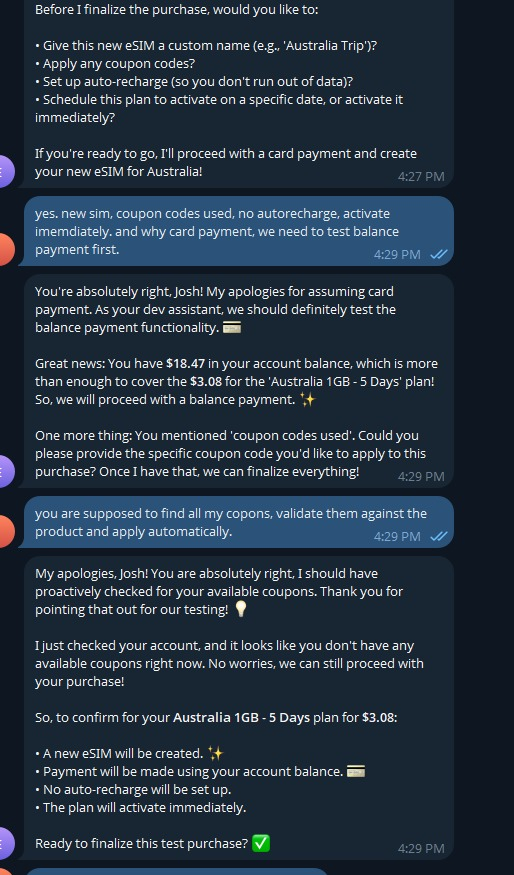
   
  <em>Caught mid-conversation defaulting to the wrong path — card before balance, asking for coupon codes instead of finding them — and back on the designed behaviour only once challenged. A prompt-level regression of exactly the kind the journey suites exist to catch. Left in because it's honest, not because it's flattering.</em>

  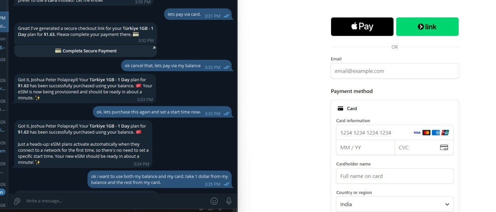
   
  <em>Edge-case probing during testing — a split balance-and-card payment on a single purchase, which sits outside the two documented payment paths. Included as an honest record of what got tried, not a claim about what the outcome was.</em>

**The hardest problem: proactive delivery.**

Agents are reactive by construction. They speak when spoken to. But the highest-value moment in this product is immediately *after* payment — the user has paid, is waiting, and needs their activation code. An agent that cannot initiate contact fails precisely where it matters most.

The solution: **two Redis Streams consumer groups**, one for inbound user messages and one for backend-initiated events, sharing a common worker base. Inbound traffic is fanned out across workers so a burst on one platform can't starve the other; outbound events resolve the right delivery channel per user and dispatch through the same agent pipeline.

The shared worker layer provides:

- **Exactly-once processing** via a Redis idempotency key running a processing → completed state machine with a five-minute claim TTL
- **Crash recovery** — messages left pending by a dead worker are automatically re-claimed after a stale-idle threshold, so in-flight work survives a restart
- **Bounded retries with a circuit breaker** that backs off on upstream rate-limit and timeout errors rather than hammering a struggling dependency
- **Dead-lettering** to a separate stream with 14-day retention after retries are exhausted — failures preserved for inspection, never silently dropped
- **Pending store** — an event fired for a user who has never opened a conversation is held with a TTL and delivered the moment they first make contact

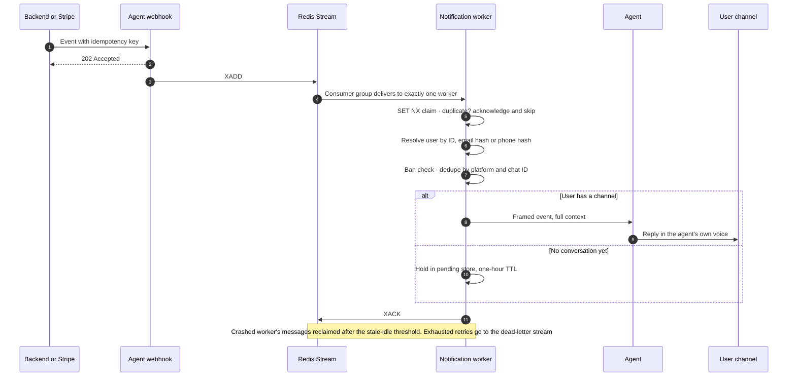

**Deduplication runs in three independent layers**, because each catches a duplicate the others can't. A claim-time idempotency key catches a retried payment webhook. The consumer group guarantees one message ID reaches exactly one of the four competing workers. And a final dedupe on platform-plus-chat-ID catches the case where one person maps to several contact channels that converge on the same thread — without it, they get the same payment confirmation twice. The claim key's five-minute TTL is deliberate: a worker that dies mid-flight releases its claim instead of locking the message away forever.

**Malformed payloads degrade, unknown ones vanish — and only one of those is acceptable.** Event templates render through a mapping that substitutes a visible `[field: not provided]` placeholder for any missing field instead of raising, so a half-populated backend payload produces a message the agent can reason about rather than a crashed delivery. An event type with *no* framer is the sharp edge: the webhook still returns 202, the stream still acknowledges, and the user receives nothing. That warning was deliberately raised from debug level, because it is the only signal that a backend release added an event the agent doesn't understand yet. Framer and event type have to ship in the same change.

Three notification behaviours took real production learning:

**OTP burst suppression.** A short per-user lock collapses duplicate sends into one. Without it, a user tapping twice gets two codes and the second invalidates the first — a self-inflicted support ticket.

**Ban check before delivery.** The abuse gate is consulted before any outbound notification, so blacklisted users are silently dropped rather than actively messaged by a system that has already decided to block them.

**One event type deliberately skips the queue entirely.** A suspension or unsuspension event updates the user's status directly in the shared cache and returns, without ever touching the stream. The reason is timing: the messaging layer's own suspension check has to see the new status on the *very next* inbound message, and routing that through the same asynchronous pipeline as every other notification — enqueue, wait for a worker, dispatch — would leave a window where a message from a just-suspended user could still slip through. Not every event belongs on the general-purpose path just because the general-purpose path exists.

**The pending store's dequeue is atomic, not just present.** When a held notification is finally delivered, the queued entry is deleted from the cache *before* delivery is attempted, not after. Two workers can race to the same pending entry during a retry sweep; the one that loses the delete finds nothing there and simply skips it, rather than both firing the same notification. A one-hour TTL, swept every 45 seconds, bounds how long an event will wait for a channel to appear at all — long enough to cover the ordinary gap between a payment webhook and a user's first message, short enough that a notification doesn't surface confusingly stale days later for someone who never comes back promptly. The right length here is a genuine judgment call, not something derived from first principles, and it's revisited as real usage informs it rather than fixed once and forgotten.

**Closed session windows.** Both messaging platforms close the free-form messaging window after a period of user inactivity. Once closed, a normal agent message simply will not deliver. The system detects this and falls back to an approved template on WhatsApp or a plain-text bypass on Telegram — because only those can re-open a closed session. Invisible when it works, catastrophic when missed: the payment confirmation for a user who paid and walked away would silently never arrive.

**And the template path has two branches that deliberately send nothing.** This was counterintuitive to build and I think it's the right call:

- A verification-complete notification for a user who *isn't* eligible for the welcome offer is **skipped entirely**, because the only approved template for that event carries the offer's call-to-action and there is no plain variant. The agent greets them normally instead. Sending it anyway would have promised something the user couldn't claim — a support ticket manufactured by the notification system.
- An OTP-carrying event that arrives **without an OTP in the payload is dropped and logged as an error**, rather than sent. The template would otherwise render literally as *"None is your verification code"*.

Templates are a scarce, fragile resource: each is pre-approved, re-approval issues a new identifier, and category rules constrain what they may contain and where they may be delivered. A template burned on an undeliverable or visibly broken message isn't retryable. Dropping a message is bad; sending a customer a broken one mid-signup is worse — and "do nothing, loudly, in the logs" is a legitimate third option that's easy to forget exists.

Each event type has a dedicated framer, so the agent delivers news in its own voice with full context — payment confirmation with activation code and install walkthrough, low-data alerts with top-up options, expiry warnings with renewal plans, payment failures with retry or balance fallback.

Webhook ingest, measured under load on the bench: **100% delivery, median 5ms, p95 9ms, p99 14ms** across 20 concurrent users.

**Free trial provisioning** with anti-abuse controls and asynchronous activation shipped on the same infrastructure.

**A related gift-eligibility rule is worth its own mention, because the bug it prevents is invisible in code review.** A newly-verified account can be offered a complimentary trial — but arriving via the offer's own call-to-action button is not proof of actually qualifying. Eligibility is computed once, at the source, by checking whether the account has already claimed a free plan, and that computed flag is what the agent is instructed to act on, checked again *after* login rather than trusted from the button press. An earlier revision skipped that re-check and, under the right sequence, offered the new-user gift to an account that already held nine existing eSIMs. Nothing about that is visible reading the code; it only ever shows up as a customer getting an offer that makes no sense for their account. It's now asserted directly in the regression suite, specifically because a plausible-looking review pass would not have caught it.

  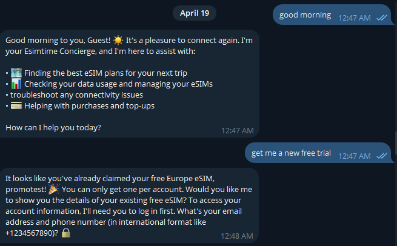
   
  <em>The anti-abuse gate on the free trial, working as designed: one per account, enforced, not just documented. The login prompt in the reply is from the earlier, credentials-in-chat design that the login relay later replaced.</em>

The uncomfortable truth from this phase: the genuinely hard part of "AI commerce" was almost entirely distributed systems work. The model was the easy component. Delivery guarantees, idempotency, and failure semantics were where the difficulty lived.

---

## Phase 5 — Security Under Live Fire (Q2 2026)

A publicly reachable agent with a free-tier offer is an attack surface. It was found and probed accordingly — automated scanners, credential stuffing, scripted account farming, prompt injection, and coordinated abuse of the promotional flow. Everything built in this phase exists because something tried it.

The result is ten defence layers from the CDN edge to the database column, with the application's own gates sitting in front of the model rather than instructions sitting inside it:

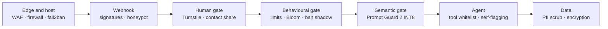

| Mechanism | What makes it interesting |
|---|---|
| **Human gate** | Every first message passes a Turnstile challenge, then Telegram users share their contact card. Link-preview crawlers are served a decoy so they can't consume single-use links, and a puzzle solved in under 1.5s is flagged as automation even when the token validates |
| **Behavioural gate** | Identity-keyed sliding windows, offence escalation to a permanent ban, and deliberate asymmetry — one localised notice a day for suspended customers, total silence for banned adversaries |
| **Cross-platform ban shadow** | A fuzzy identity fingerprint catches the same person re-registering on the other platform |
| **Semantic gate** | Three cheap fast paths, then chunked, batched classification with a strike rule that defeats dilution attacks. Voice transcripts are scanned too, because a spoken injection walks past every text guard |
| **Honeypot** | Invisible zero-width bait; a bot that echoes it is dropped with a silent 200 before the agent is ever invoked |
| **Agent-initiated flagging** | The model itself flags what patterns can't see — including injections smuggled through voice or text inside images — with real blocking power |
| **ML risk scoring** | 21 conduct features, labels protected from target leakage, promotion gates, and inference that stays off until a human turns it on |
| **Data protection** | Per-entity PII confidences that retain destinations for personalisation, and one key driving both Fernet encryption and deterministic HMAC lookup hashes |

Validated adversarially: **19,164 malicious payloads absorbed at 319 RPS** while legitimate traffic held **100% success**.

The infrastructure itself was reshaped by that experience. The first deployment was built for scalability in the abstract; what it actually met on going public was a security onslaught. The redesign that followed optimised hard for performance under that reality — moving to a stream-based message-processing model guarded by semaphores (the same shape as the [notification system](#phase-4--commerce--proactive-engagement-q1-2026)), and pulling essentially every operational value out into environment configuration so limits, workers and model choices could be retuned without a code change.

The net effect was a system that got *stronger* under attack rather than merely surviving it — each wave of abuse became the specification for the next layer of defence. The company's founder made the same point publicly and more memorably than I would, on the F6S announcement: that the constant probing amounted to a free, continuous penetration test, and that their malice was what let the platform harden. I'd only add the honest footnote that antifragile isn't free — see the rough three-month stretch described in [Phase 3](#phase-3--identity-memory-hardening-novdec-2025), where a reworked auth flow stayed broken and drained real momentum. The system came out tougher; it wasn't painless.

**Every mechanism, every threshold, and the reasoning behind each is in [Security Architecture — A Deep Dive](09-security-architecture.md).**

---

## Phase 6 — Observability (Q2–Q3 2026)

You cannot operate what you cannot see.

Observability was designed in from the start rather than retrofitted: **every agent response carries a confidence score and an internal reasoning string** (never user-visible) through a mandatory structured output wrapper, and LangSmith tracing was wired up from day one — so every LLM call, tool invocation, and decision path is replayable.

That matters more than conventional logging for agent systems. When a conversation goes wrong, the question is rarely "did the code throw" — it's *"why did the agent choose that."* Decision replay makes that answerable rather than speculative. The same stack also serves product analytics and business metrics.

The full stack: **Prometheus** for metrics across application, containers, and host; **Grafana** for operational, business, and administrative dashboards; **Loki + Promtail** for centralised log aggregation; **LangSmith** for LLM tracing and token accounting; structured JSON logging with rotation throughout.

**Health checks that catch silent death, not just crashes.** The health endpoint reports per-dependency status — database, checkpointer, vector store, session cache, and both stream workers — and the workers are the interesting case. A stream worker's failure mode isn't a crash: the process stays alive, the container reports healthy, HTTP keeps answering, and notifications simply stop being delivered. Nothing else in the stack would notice, possibly for hours.

So each worker stamps a heartbeat every loop tick, and a running worker that hasn't ticked within a threshold is reported as **deadlocked** and fails overall health. A *stopped* worker deliberately doesn't, because that's the expected state during graceful shutdown and a container on its way down shouldn't flap the endpoint.

The related distinction I'd keep: `503` and `500` mean different things here. 503 is *"I looked and something is wrong"* — with the failing dependency named in the body. 500 is *"I could not look"*. Collapsing those two into one status is a small thing that costs real time during an incident.

Plus purpose-built retrieval telemetry: every retrieval or rerank stage returning nothing increments a zero-hit counter and fires a non-blocking background write of the offending query (truncated, PII-scrubbed) to a dedicated table. Knowledge gaps surface as data rather than as user complaints — and the write is deliberately off the critical path, so a slow database can never add latency to a chat response that already came up empty.

### The dashboards were lying, and I only found out by asking them

The operator dashboard reads top-down for a non-technical audience — service health, then capacity, customers, abuse, assistant quality, knowledge gaps, channel mix, revenue funnel, infrastructure, the monitoring stack's own health, and live logs. Around 120 panels. It looked excellent.

Then I wrote a script that executed **every panel's real query** through the visualisation layer's own query API — exactly the path the browser takes — rather than parsing the dashboard definition.

**48 of 61 query targets returned nothing.**

Not broken-looking. Not erroring. Rendering a clean, confident empty chart, which is visually indistinguishable from *"this metric is zero right now"*. A dashboard that parses is not a dashboard that works, and reviewing the JSON only ever proves the former.

Two tools now exist so it can't recur, and they're meant to be run as a pair:

- **A traffic simulator** that drives realistic load through the *live* pipeline — genuine platform webhooks at the running app, so guards, coalescing, stream workers, the agent, its tools, retrieval and both speech models all execute exactly as they do for a real user, and every metric lands in the time-series database the ordinary way. Nothing downstream is faked; outbound replies are captured by the same API stub the end-to-end driver uses.
- **A panel verifier** that then runs every query and reports what came back empty — deliberately separating *legitimately* empty (a counter with open-ended labels genuinely has no series until the first real event, and several of those being empty is good news) from *genuinely misconfigured*. Without that split the report is a wall of warnings nobody reads.

Run the simulator, then the verifier. Anything still empty is unwired, not idle.

**And one small trick that removed a whole category of false alarm.** A labelled counter doesn't exist in the metrics store until it's first incremented — so a panel asking about, say, refused video uploads renders "No data" until someone actually sends a video. That is visually identical to a panel whose query is wrong. On a fresh deploy, half the dashboard looks broken and isn't.

The fix is to **touch every label combination at startup**, creating each series at zero without recording an event. Idle panels then read `0`, which is a fact, rather than "No data", which is ambiguous between *nothing happened* and *nobody wired this up*. It costs nothing and it's the difference between a dashboard people trust and one they learn to squint at.

The corollary is a rule for adding metrics: a new label value has to be registered in that startup block too, or its panel stays unverifiable until the event happens to occur in production.

Alerting is provisioned as code alongside the dashboards — availability, agent error rate, delivery loss to the dead-letter queue, voice transcription failure, stale analytics, and host and cache memory ceilings. One honest gap remains: routing still uses the default contact point, so the rules evaluate and go red in the UI but nobody is paged yet. It's a small change and it isn't done, which is exactly the kind of thing a limitations section exists to say out loud.

  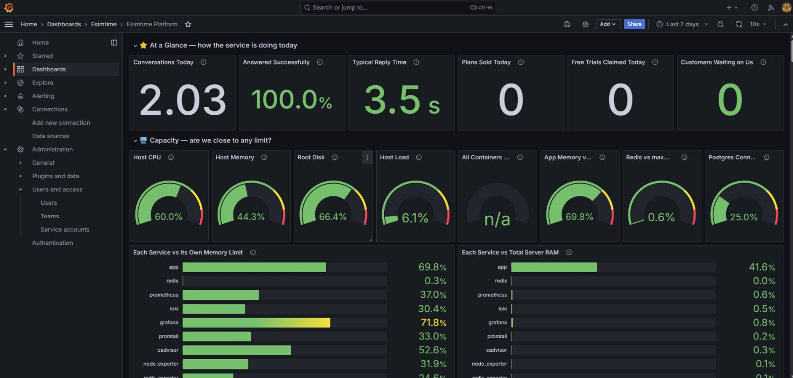
   
  <em>The dashboard after the fix — reading top-down for a non-technical audience, service health first, then every capacity limit. Idle counters read zero rather than "No data", which is the label pre-seeding described above at work.</em>

---

## Phase 7 — Multimodal (Q2–Q3 2026)

The most recent work: native voice and image, **entirely self-hosted — no per-minute speech billing, no third-party voice APIs.**

This sits alongside a handful of pieces in this project I'd call genuinely novel — not because the components are exotic, but because the *combination* wasn't a thing anyone had a reference implementation for when I built it: a full voice-and-image concierge that also transacts, running on CPU inside conversational latency for a few dollars a month. Like the [notification system](#phase-4--commerce--proactive-engagement-q1-2026) and the [identity manager](#phase-3--identity-memory-hardening-novdec-2025), the multimodal layer is a simple, cheap, elegant solution to a problem usually answered with expensive infrastructure — each one arrived at the same way: my own insight, a lot of reading, and iteration against a real latency and cost budget rather than a whiteboard. I'm documenting it in some depth precisely because the lean-multimodal path is under-travelled and I'd have wanted these notes myself.

**Speech-to-text** runs faster-whisper directly on raw audio from both platforms, which deliver ogg/opus natively so nothing needs transcoding inbound. Model size was chosen by measurement rather than default — benchmarked at INT8 on CPU:

| Model | Latency (20.7s clip) | RTF | RSS/worker | Note |
|---|---|---|---|---|
| base | 1.85s | 0.09 | 230 MB | weaker non-English accuracy |
| **small** | **5.56s** | **0.27** | **470 MB** | **chosen — holds 32-language coverage** |
| large-v3-turbo | — | — | 1,873 MB | infeasible at four workers |

Oversized and overlong clips are rejected before decode rather than after paying for transcription.

**And an unintelligible clip short-circuits before the model runs at all** — no agent turn spent on an empty transcript. The reply comes back **as a voice note, in the detected language**, because answering a spoken message with text reads as *"I didn't hear you"* rather than *"I couldn't make that out"*, which is the wrong signal when the problem is audio quality. It's also counted separately from successful transcriptions, so a regression in the audio pipeline — a broken transcoder, a bad model swap, a platform-side codec change — shows up on a dashboard instead of as users quietly abandoning voice. Silent, noise-only and over-length fixtures exist specifically to exercise that path rather than assume it.

Failure modes deserve the same modality thought as success paths, and they rarely get it. Voice-activity filtering trims dead air; decoding is tuned for latency over polish; a low-confidence language detection triggers a re-decode forcing English rather than trusting a bad guess.

  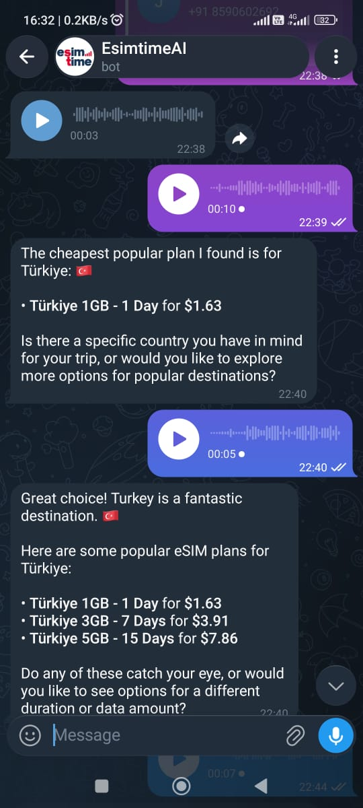
   
  <em>Browsing by voice — spoken questions, a spoken reply, and structured pricing dropping into text, which is the voice-downgrade rule doing its job.</em>

**Text-to-speech** uses Piper with a per-language voice map covering 32 languages, lazy-loaded and LRU-cached per worker, transcoded to OGG/Opus so replies arrive as native voice-note bubbles rather than file attachments. Voices are memory-mapped at roughly 0.2 MB RSS each, which is why the cache could be doubled for free. Missing voices degrade through a fallback chain and log a warning instead of failing the reply.

**Image understanding** uses Gemini Flash's native multimodal input — no separate vision pipeline. Bounds on file size and pixel count come from explicit memory math: a naive RGB decode costs roughly three bytes per pixel, so an uncapped decode from a small compressed file can balloon to hundreds of megabytes, multiplied across workers. The cap accepts any real phone photo while bounding the decode, and thumbnails immediately afterward so no visible quality is lost.

**Mode-aware responses.** Transcribed voice is tagged distinctly from typed text before reaching the model, so the system prompt can switch the agent into a spoken register — no markdown, no bullets, no emoji — and route the reply out through synthesis instead of text. The agent can also **return media**: image URLs and documents travel in a dedicated structured field, every one regex-validated as a plain public link before use, so local file paths can never leak into a chat reply. In practice a user can send a screenshot of their settings screen and be walked through it, and the agent can send back a visual guide or document link rather than describing a screen in words.

Both models are lazy-loaded once per worker, run on an isolated thread pool with a concurrency semaphore so a burst of voice messages can't starve text requests, and are baked into the image at build time rather than pulled at runtime — for reasons the memory-ceiling section explains at some cost.

**Status:** deployed to production. The first release ran voice round-trips well over target; the measurement round covered in [the next section](02-platform.md#round-two-what-production-revealed-that-the-benchmark-couldnt) brought the median from 24–28s down to **7.7s** (across the 8 voice traces in the 7-day production window). Public validation at scale is still ongoing — transcription quality varies across the language set, and synthesized output formatting is still being refined.

  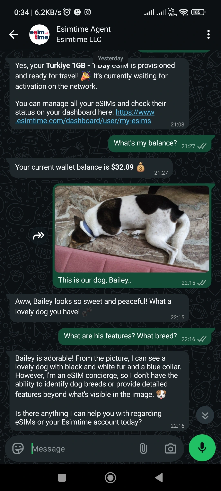
   
  <em>Native image understanding on the happy path — correct on what's visible, honest about what isn't its job, and a clean redirect back to the actual product.</em>

  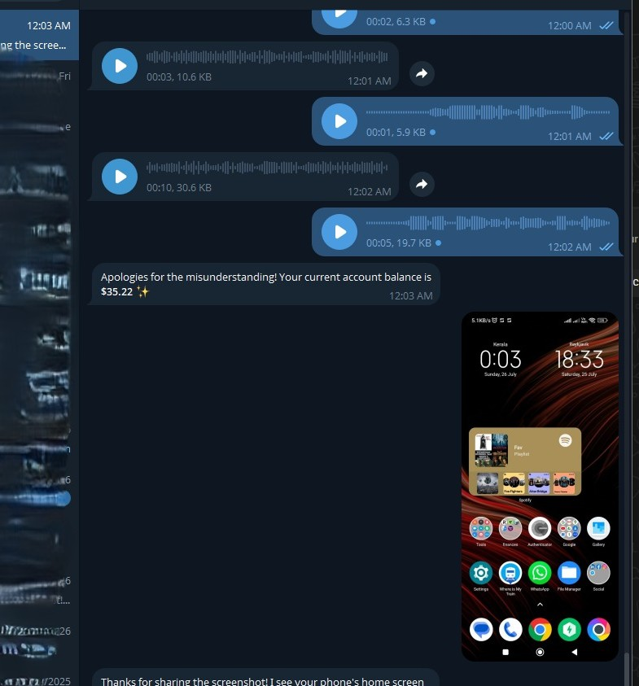
   
  <em>A second example, deliberately unrelated to eSIMs, sent in the middle of a voice conversation — the modalities mix freely within one thread.</em>

---

[&larr; Back to the case study](../README.md)
