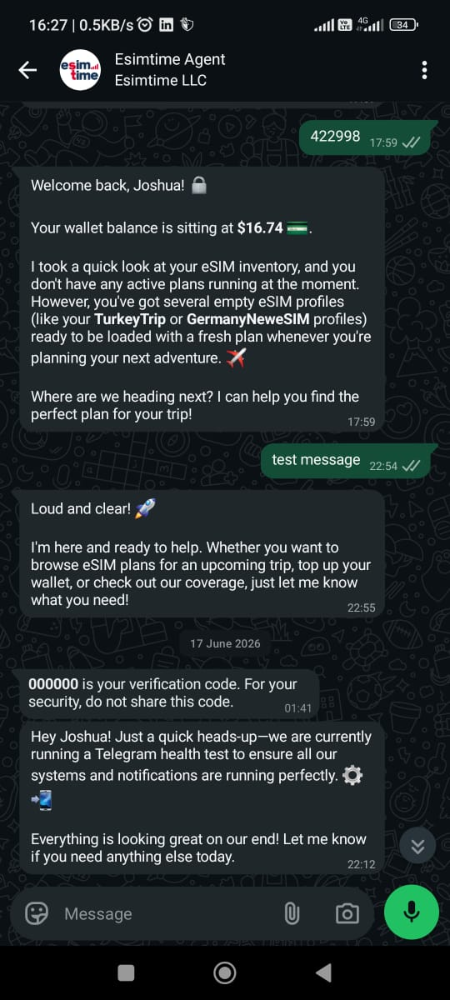
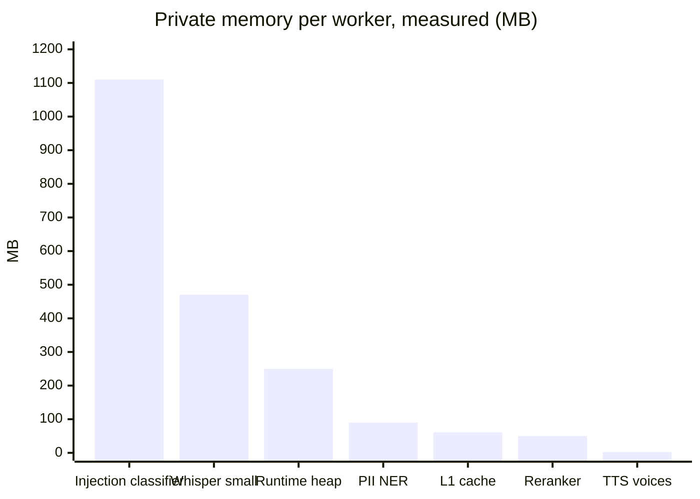
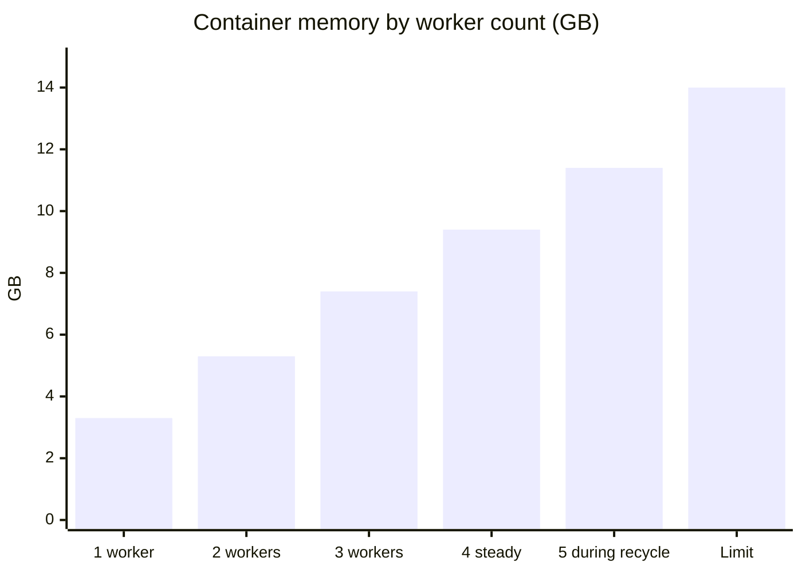
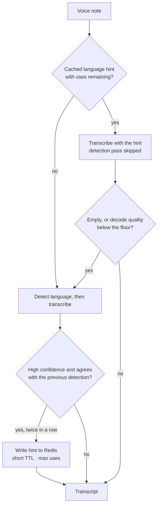

[&larr; Back to the case study](../README.md)

# Platform Constraints - Delivery, Localisation and the Memory Ceiling

*Exactly-once message delivery, ten-language template localisation, and what it takes to run a full ML model set inside a fixed RAM budget.*

---

## Message Delivery & Localisation

Getting an agent's words onto two different messaging platforms correctly is a surprising amount of engineering.

**Platform-aware chunking.** The two channels have different character limits, different formatting dialects, and different tolerances for rapid sends. Long responses are normalised (escaped newlines resolved, header spacing corrected, excess blank lines collapsed) and then split by a markdown-aware splitter that breaks at natural boundaries — headings, paragraphs, list items — rather than mid-sentence. Chunks are paced with a per-platform inter-message delay so a multi-part answer arrives in order and doesn't trip flood protection.

**The limits are fixed, the delays are tunable — and that split is deliberate.** Telegram chunks at 3,800 characters, WhatsApp at 1,400, both set deliberately below the platforms' true ceilings to leave headroom for formatting expansion; those are properties of the platform and don't change. The pacing between chunks is different: WhatsApp waits roughly two and a half times longer between parts than Telegram, because the underlying delivery provider tolerates rapid sequential sends noticeably worse. That number is a flood-protection trade-off, not a hard limit, and it's the first thing worth raising if multi-part replies ever start arriving out of order.

The splitter is also **code-fence aware**, which sounds fussy and isn't: a split landing inside a fenced block leaves the first chunk with an unterminated fence and the second rendering as literal backticks. In this product that means an installation command reaching a customer as visible markup, mid-troubleshooting. So the splitter closes the fence on the way out and reopens it — with its language tag — on the way in.

**One platform retries until it hears back; the other doesn't.** Telegram will re-deliver an update until the webhook acknowledges it, while WhatsApp (via the provider) makes no such repeat guarantee. That single asymmetry shapes how each channel's handler treats acknowledgement and idempotency: on Telegram a slow or failed ack means the *same* message arrives again, so the pipeline has to be idempotent against replays; on WhatsApp a dropped message is simply gone, so the cost of not-acking is the opposite failure. Same webhook contract on paper, two different delivery realities to design against.

**Delivery failures come in classes, and treating them alike is expensive.** A *forbidden* response from Telegram means the user has blocked the bot. That isn't transient and won't recover on retry, so the chunk loop stops at the first one rather than sending every remaining part of a multi-chunk reply into the same guaranteed failure — otherwise one user's block becomes N failed API calls per message, and blocked users are common. Timeouts and network errors *are* retried. A closed session window is neither: no retry will help, only a template or a plain-text bypass can reopen it.

**Three independent defences for one failure.** When a reply is going to speech, markdown symbols aren't *spoken*, they're deleted — and links collapse to their label, never the URL, because reading a checkout link aloud produces "h-t-t-p-s-colon-slash-slash" and is worse than useless. But that formatter is the *third* layer: the system prompt already tells the model to write in a spoken register, and the output wrapper already downgrades a voice reply containing a link to text regardless of what was requested. The formatter is what holds when the model ignores an instruction — which, over enough turns, it will. Where a failure is both likely and user-visible, one guarantee at the boundary beats three hopeful ones upstream; here it's cheap enough to have all three.

**Platform-specific affordances.** Payment links render as a native inline keyboard button on Telegram, which is a materially better checkout experience than a raw URL; WhatsApp gets a formatted text link, because session-mode inline buttons aren't available there. Telegram supports callback queries for button interactions; WhatsApp requires a specific XML response format on the webhook. Both webhooks acknowledge immediately and process in the background, so platform timeouts never fire on a slow LLM call.

**Message coalescing, because people don't type in paragraphs.** They send three short lines in four seconds. Treated naively that's three agent runs: three model calls, three tool budgets, and an agent answering the first fragment while the user is still typing the context for it — which reads as an assistant that interrupts.

Inbound messages are therefore buffered per user for a fraction of a second and joined before dispatch, with the first arrival winning a short lock that schedules the flush. Cheap, and it fixed a class of "the bot didn't listen" complaint that no amount of prompt work would have touched.

It closed a security hole too, which I didn't anticipate: the abuse guards now score the *whole* utterance rather than three sub-threshold pieces, so splitting a payload across rapid messages stopped being a way around the rate limiter. Worth noting the general shape — a UX fix and an abuse fix turned out to be the same change, because both were caused by treating one intent as three events.

**Broadcast.** Beyond per-user proactive events, an authenticated endpoint fans a single message out to every user with an active channel, through the same stream, the same ban checks, and the same closed-window template fallback as any other notification. Deliberately not a separate delivery path — a broadcast that bypassed the abuse gate would be the fastest possible way to message someone you'd already decided to block.

<p align="center">
  
  <br/>
  <em>A broadcast landing through the ordinary notification path — same pipeline, same guards, nothing special-cased.</em>
</p>

**Localisation.** System-generated messaging — verification prompts, phone-share requests, rate-limit and suspension notices, OTP fallback text, and the entire human-verification web page — ships in **ten languages**: English, Turkish, German, Spanish, French, Hindi, Malayalam, Portuguese, Italian, and Arabic, the last with right-to-left layout. Locale resolves from the Telegram client's declared language, the WhatsApp number's country prefix, or the browser's accept-language header, depending on where the user is being addressed.

**Inferred locale and declared locale deserve different confidence.** A phone country code is a guess about language; a client's declared language setting is a stated preference. So India's `+91` prefix deliberately resolves to English even though Hindi and Malayalam catalogues exist — those are reachable when the user's own client asks for them, not when a prefix implies it. Guessing wrong on a *system* message is a bad failure: it's the message someone reads when something has already gone wrong, so an unreadable one compounds the problem rather than softening it. Defaulting to a language they certainly read beats a coin-flip at a language they might prefer.

This is separate from the agent's own multilingual ability — the model mirrors whatever language the user writes in, maintains it across turns and platform switches, and handles code-switching mid-conversation without losing the thread. The localisation layer covers everything the *system* says outside the agent's voice, which is exactly the messaging a user hits when something has gone wrong. Being rate-limited in a language you don't read is a bad experience to have designed.

<p align="center">
  
  <br/>
  <em>The agent's own multilingual text handling, working end to end in Turkish — distinct from the system-message localisation described above, and from the voice-synthesis bug in <a href="07-reflections.md#known-limitations">Known Limitations</a>, which affects speech output specifically, not text.</em>
</p>

---

## Constraints You Cannot Engineer Around

Some limits aren't in your architecture. They're in the platforms you sit on top of, and no amount of good code moves them. Two shaped this system significantly.

### Payment: the deliberate handoff

Checkout hands the user to the payment provider's hosted page in a browser rather than collecting anything in the conversation.

That's a design decision, not a limitation. Card details never touch the platform, so the compliance surface stays where the specialists are, and the security-critical step isn't reimplemented inside a chat interface by someone who isn't a payments company. The agent's job is to get the user to the right checkout with the right plan, the right discount, and the right eSIM target — and then to be waiting on the other side with the activation code the moment the webhook fires.

There's a real UX cost: a context switch out of the conversation. It's the correct trade. Some flows should not be replicated for convenience, and payment is the clearest example.

### Business-initiated messaging: the plan that looked perfect

The revised authentication journey was clean on paper. The system would reach out to the user on WhatsApp with a verification code and an invitation to continue in the agent — business-initiated, template-based, exactly what the platform's template system exists for.

In production it proved unreliable in ways that could not be fixed from our side:

**The messaging window closes.** Free-form messages only deliver within a limited window after the user's last message. Outside it, only approved templates go through at all — which is why the notification pipeline has template fallback built in. But templates carry their own constraints.

**Templates get silently recategorised.** Platforms classify templates into utility, authentication, and marketing tiers, and the classification is inferred from content. Mixing content types — a transactional update carrying any promotional element — reclassifies the whole template as marketing. So does content the classifier finds ambiguous. You can write what you consider a utility message and have it treated as marketing.

**Marketing-tier messages are throttled by the platform, not by you.** Delivery is decided per-recipient based on their engagement history and inbox load. In some markets marketing templates are blocked outright. There is no visibility into whether a specific user is currently throttled, no way to query when a block lifts, and no escalation path — the carrier and the platform both surface this as an opaque non-delivery. Retrying immediately does nothing except generate the same failure.

**Authentication templates are heavily restricted.** No URLs, no media, no emoji, tight parameter length limits, mandatory preset structures and a one-time-password button. Write anything outside that shape and it won't approve.

**And some regions don't permit them at all.** This is the constraint that broke the plan. Authentication templates are not supported for Indian recipients under platform policy — the single message type the onboarding flow depended on simply does not deliver to one of the largest mobile markets on earth. Separately, marketing-tier templates are blocked outright for US recipients. Others sit behind per-country geo-permissions that can be restricted for regulatory or compliance reasons, sometimes requiring local business registration to lift, sometimes held at the platform's discretion.

The pattern to internalise: **template deliverability is a function of the recipient's country, not just your account configuration.** A flow that tests perfectly against your own number can be structurally undeliverable to entire national markets, and you will not discover that from your own testing — you discover it from users who never arrive.

**Recipient-side failures are invisible to you.** A number not registered on the platform, a user who hasn't accepted the current terms of service, or a client below a minimum version all produce the same class of delivery failure — none of which you can detect in advance or resolve on the user's behalf.

Stack those together and business-initiated outreach isn't a delivery mechanism, it's a lottery. For a *marketing* nudge that's acceptable. For the message carrying someone's verification code, it isn't — a user who never receives their code doesn't retry, they leave.

**The structural response.** Rather than hardening a channel we don't control, the flow is being inverted so that the user sends the first message and the conversation opens from their side. That sidesteps the window, the template tiers, the throttling, and most of the recipient-side failure classes in one move — because none of them apply to a reply.

It's the same lesson as everywhere else in this document. The unreliable path wasn't made reliable by retrying harder or writing better templates. It was removed by changing who initiates.

---

## Operating Under a Memory Ceiling

Adding speech models to a box already carrying three quantized classifiers is where the constraint stopped being philosophical.

### The boot loop

After the multimodal deploy, production entered a startup loop — workers spawning, dying, re-forking, never becoming healthy. Two independent root causes, and the second is the more interesting failure.

**Cause one:** the largest speech model measured at 1,873 MB RSS *per worker* against 470 MB for the chosen size. Four workers multiplied that straight through the memory ceiling at boot.

**Cause two, the subtle one:** the model size was configured as a runtime environment variable but never wired through as a *build* argument — so the image only ever baked the smaller model. Every worker therefore tried to pull well over a gigabyte of weights from the model hub during application startup.

That alone would have been a slow boot. What made it an **infinite** loop is that the ASGI worker emits no heartbeat until startup completes — so a worker downloading weights is, to the supervisor, indistinguishable from a hung one. The timeout reaped each worker mid-download, the master re-forked it, the replacement began the same download from scratch, and it never got far enough to cache anything. A configuration mismatch presenting as an infrastructure failure.

The trap inside the trap: the instinctive fix is to *shorten* the timeout to fail faster, which makes it strictly worse. And raising it wouldn't have fixed it either — it would have papered over a runtime that disagreed with its own image. Worth recognising the shape: when a supervisor can't distinguish "working slowly" from "hung", every timeout value is wrong and the real fix is elsewhere.

The fix was structural rather than a tuning change: wire model selection through the build pipeline so image and runtime cannot disagree, and hard-fail the build if any declared model can't be fetched — so a mismatch surfaces at build time, loudly, rather than at 3am as a boot loop.

### The measured memory model

I replaced estimates with direct measurement inside the running production image, on the actual CPU code path:

```
Container total = SHARED (pre-fork, COW)  +  N_workers × PRIVATE

SHARED — loaded once by the master under preload,
         charged to the cgroup once ......................  1,260 MB

PRIVATE — allocated per worker at startup, never shared:
  Injection classifier   (INT8 ONNX) ...................  1,110 MB
  Speech-to-text         (INT8, incl. decode) ..........    470 MB
  PII NER                (INT8 ONNX) ...................     90 MB
  Reranker               (INT8 ONNX) ...................     50 MB
  L1 query-vector cache ................................     61 MB
  TTS voices             (mmap, page-cache shared) .....     ~2 MB
  Runtime heap / COW dirtying / buffers ................   ~250 MB
                                                        ───────────
  PRIVATE per worker ................................... ≈2,033 MB

  4 workers steady ..... 1,260 + 4 × 2,033 =  9.4 GB
  +1 recycling ......... 1,260 + 5 × 2,033 = 11.4 GB  ← sizing target
```





Sizing to the *recycle peak* rather than the steady state, with headroom above it, is the difference between a stable deploy and one that dies during a rolling restart.

### Measuring instead of assuming

Two investigations worth keeping as examples of the discipline:

**The 1.1 GB question.** The injection classifier's footprint looked like it might be ONNX Runtime's memory arena rather than genuine weights. Disabling the arena changed resident memory by **zero** and cost **+12% latency** — proving the memory was real FP32 embedding weights surviving dynamic quantization, and that the "optimisation" was a pure loss. A five-minute experiment that prevented a wrong architectural conclusion.

**Worker topology.** Eight workers thrashed the available cores; four with bounded per-worker thread counts held. The deciding argument wasn't CPU at all — the upstream LLM's rate limit is the real throughput ceiling, so additional workers buy nothing but memory pressure. The right worker count was set by the *external* bottleneck, not the local one.

Everything above is re-measured whenever the model set changes. Estimates are what produced the boot loop.

### Round two: what production revealed that the benchmark couldn't

The fix held. Production booted all four workers cleanly, loaded the speech model from the baked image with no runtime download, and ran without restarts, OOM kills, or worker recycles. The boot loop was genuinely gone.

Then production logs surfaced three things no benchmark had shown.

**The benchmark had measured the wrong thing, not the wrong machine.** Voice round-trips were landing at 23–28 seconds against a component benchmark that implied far less. My first instinct was to blame the hardware — *prod is just slower than my laptop* — and I spent a while reasoning from an assumed slowdown factor. That was the wrong model of the problem, and it sent me looking in the wrong place.

The component benchmark had timed one model decoding one clip in isolation. Production traces measured the *whole pipeline* under real conditions: download, decode, a padded encoder window, language detection, transcription, agent turn, synthesis, delivery. The gap wasn't a hardware multiplier — it was everything the benchmark had left out, and two specific pieces of waste inside it. Component numbers do not compose into end-to-end numbers, and a single fudge factor will never bridge them.

**Transcription cost is flat regardless of clip length.** A 1.5-second voice note cost roughly the same as a 5.2-second one — around 11–14 seconds either way. The reason is that the encoder always processes a padded 30-second window whatever the actual audio duration. So the intuition "short clips are cheap" is simply false, and any optimisation premised on it is wasted effort. Transcription accounted for about 45% of every voice round-trip.

**And the system was paying that encoder pass twice.** Once for language detection, once to actually transcribe. Nobody designed that; it's what you get from calling a convenience API without reading what it does underneath. Roughly half the transcription cost was a duplicated pass.

Three fixes followed, in ascending order of care required:

**Raise the per-transcription thread count.** This reversed my own earlier conservative call. I'd capped threads low out of a theoretical concern about contention between event loops and inference threads. Production showed the contention risk was hypothetical and the latency cost was real — a per-worker concurrency cap of one transcription already bounds the worst case, and the upstream model's rate limit means simultaneous voice traffic is rare. Measured cost beat theoretical risk.

**Disable timestamp generation.** The transcription path only ever joins segment text and never reads timestamps, so generating timestamp tokens in the decoder was pure waste. Free improvement, zero behavioural change — the kind of thing you only find by reading what your own code actually consumes.

**Cache the detected language per user to skip the detection pass.** This is the one that needed real care, because getting it wrong means transcribing someone's speech in the wrong language — a far worse failure than being slow. The design degrades to *current behaviour*, never to a wrong result:

- The hint is written only on a high-confidence detection, and only after **two consecutive agreeing detections**. A single fluke can never lock a user into a language.
- It's stored in the shared cache rather than per-worker memory, because messages round-robin across workers — a local cache would be wrong most of the time.
- **The guardrail that makes it safe:** if a hinted transcription comes back empty, or its decode-quality score falls below a floor, it immediately re-runs with detection enabled and discards the hint. A mismatch costs one extra pass. It cannot silently produce a wrong-language transcript.
- **A max-uses backstop** forces a real detection every few notes regardless, so someone who switches language mid-conversation is always picked up rather than carried on a stale hint until the TTL expires. The expiry is a floor on staleness, not the only defence against it.
- Short TTL, and a single setting that disables the whole mechanism.



**Outcome.** The target was roughly 12 seconds of transcription down to 3–6. Production traces then showed a **voice round-trip median of 7.7 seconds** (8 voice traces in the 7-day window — a small sample, reported as such) against the 24–28 seconds these logs originally surfaced — a little over 3× — with synthesis at 1–3s and the duplicate encoder pass gone entirely. The tail is still long (worst observed ~29s), because a genuinely long clip on slow silicon is still a genuinely long clip; the median is what moved.

Worth being precise about *why* it moved, because it wasn't clever: one duplicated pass removed, one unused decoder feature disabled, one over-conservative thread cap reversed. No new model, no new hardware, no architectural change. The entire win came from reading what the code actually did and what the logs actually said. The most expensive stage in the pipeline was paying for work nobody had asked for, and it stayed that way until someone looked.

### Measure before you build the optimisation

The other finding was a static prefix of roughly 15,000 tokens re-sent on every single turn — system prompt plus tool schemas, neither of which ever changes. An obvious caching target, and the prompt was already structured correctly for it, with the static block first and dynamic state appended.

The instinct is to go build explicit prompt caching. The better first move was one line: add the cached-token count to the existing token-usage log. The model tier already performs *implicit* caching above a prefix threshold, so some or all of the benefit may already have been arriving for free. Building an explicit cache without checking would have been a day of work to reimplement something already running.

**It did prove necessary, and it shipped.** The static head and every tool declaration now live in an explicit provider-side cache; only the live-context tail — timestamp, identity, auth status, pending intents, retrieved memories — is sent per turn. What's interesting is that every one of the failure modes I'd written down in advance turned out to be the actual design constraint rather than an edge case:

**The tool declarations had to go into the cache too.** This was the one that reshaped the implementation. The provider rejects a request that sets cached content *alongside* tool declarations or a system instruction — so the cache has to hold both, and the calling code has to skip its normal tool-binding step entirely while a cache is active. Caching the prompt and binding tools the usual way isn't a suboptimal combination; it's a request that gets refused. The library's convenience path and the provider's caching path are mutually exclusive, and nothing says so until you try it.

**With a cache active, the system-instruction slot is closed.** Message contents accept only user and model roles. So the live-context block, which genuinely is system-level information, rides in as the opening *user* turn with a header re-asserting its authority to offset the role demotion. That's a real compromise, and I'd rather name it than pretend the design is clean.

**The cache key is a content hash, not a name.** Model identifier, static prompt text, and the sorted tool signature all hash into the key. Any prompt edit, tool rename, or model migration mints a fresh cache automatically. A name-keyed cache would have kept serving a stale prefix after a prompt change — invisible until behaviour drifted, and close to impossible to diagnose from the symptom.

**One worker mints it, the rest reuse it**, via the leader-election pattern already in the codebase rather than a second coordination mechanism. The shared handle is stored with a shorter TTL than the cache itself, so the local record expires before the remote object does — never the other way round.

**And the whole thing fails to "off", not to broken.** Every path returns "no cache" on any exception, which means normal tool binding, full prompt, higher token cost, identical behaviour. A cache outage degrades economics, never correctness. For an optimisation sitting in the request path of a system that moves money, that's the only acceptable failure posture.

**That covers construction-time failure. Runtime failure, after a healthy cache expires mid-operation, is a genuinely different and more dangerous shape — and it doesn't self-correct by default.** The cache reference is resolved once and baked into the model client when the agent is built, and tool-binding is skipped entirely while a cache is active. So if the provider drops the cached content later — a TTL lapsing, a quota event, anything upstream — every subsequent turn fails, permanently, with nothing obviously wrong in the logs, until the process happens to restart. An optimisation that fails safe at construction can still fail unsafe hours into being healthy, which is the more dangerous of the two shapes precisely because it looks fine right up until it doesn't.

The fix: the agent watches for that specific class of cache-rejection error, and on a match **discards its own singleton instance rather than trying to repair the live one in place.** The next turn rebuilds the agent from scratch, which re-enters the same cache-resolution path used at startup — the one that already validates the stored reference and mints a fresh one if it's dead. One failed turn, then full recovery, instead of a silent outage that only ends when someone notices and restarts the process by hand. Worth stating as a general pattern: a resource baked into a long-lived object at construction time needs its own recovery path distinct from "handle the exception and move on", because the object holding the stale reference is the thing that has to go, not just the call that failed.

The general lesson isn't about caching. It's that writing down the failure modes *before* building was worth more than the implementation was — because in this case the failure modes turned out to be the specification.

---

[&larr; Back to the case study](../README.md)
