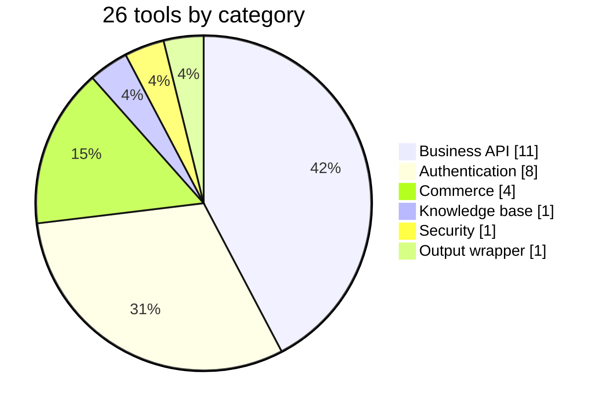
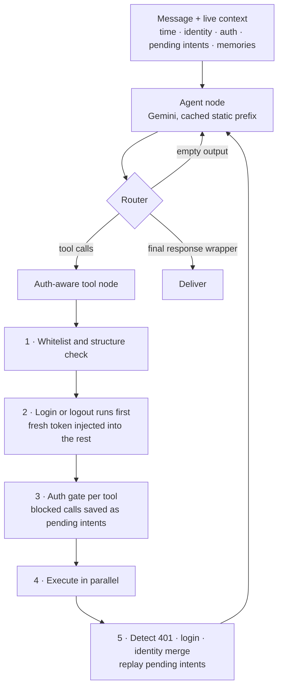
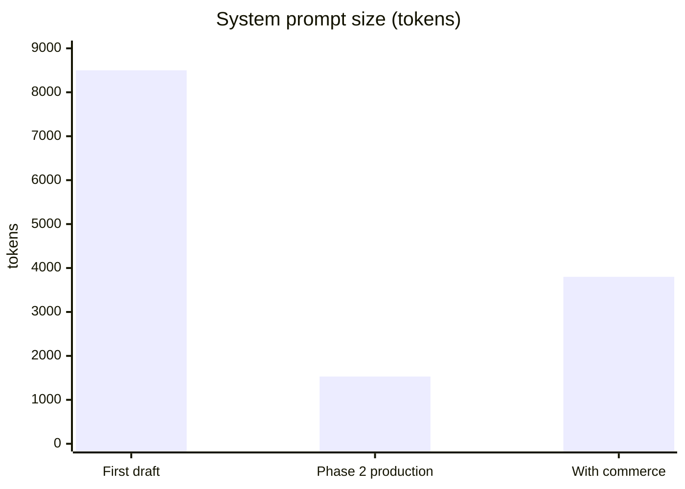
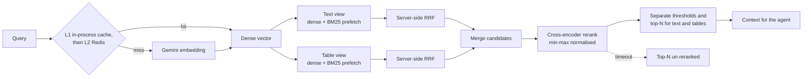
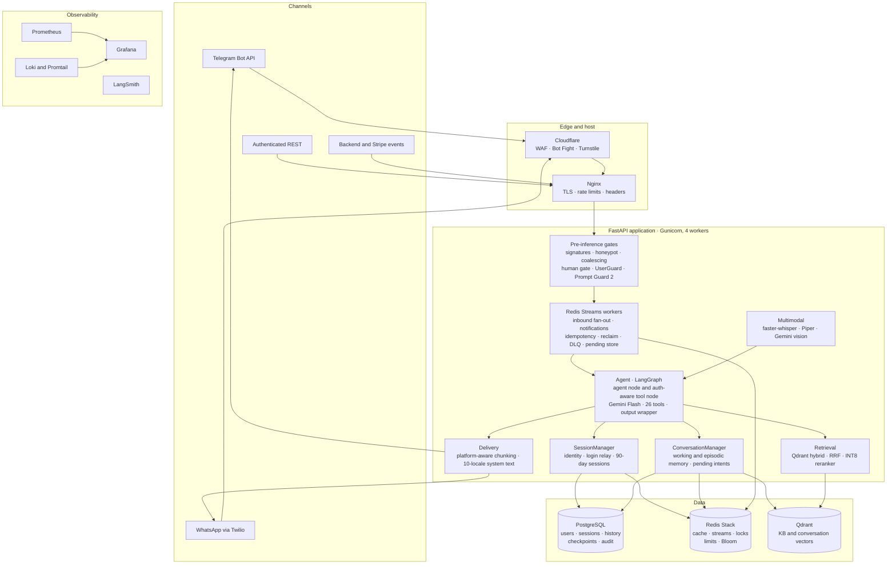

[&larr; Back to the case study](../README.md)

# System Architecture

*The agent loop, the system prompt, hybrid retrieval, the data layer, and the full technology stack.*

---

## The Agent Itself

**26 tools** across six functional categories, every one schema-validated:

| Category | Count | Coverage |
|---|---|---|
| **Authentication** | 8 | Web-link login relay, password fallback, signup with risk scoring, link resend, password reset, logout |
| **Commerce** | 4 | Purchase (new eSIM or top-up existing), wallet top-up, payment verification, free trial claim |
| **Business API** | 11 | Profile, balance, invoices, popular/country/region plans, eSIM inventory and usage, coupons, validation, support tickets |
| **Knowledge Base** | 1 | Multi-query hybrid retrieval |
| **Security** | 1 | Agent-initiated suspicious-user flagging |
| **Output** | 1 | Mandatory structured response wrapper |

The loop itself is deliberately small — two graph nodes and a router — with the complexity concentrated in the tool node, where authentication and hallucination handling live:

Design decisions worth surfacing:

**Every response passes through a mandatory output wrapper.** Raw text output is banned. Each turn returns user-facing markdown, a confidence score, an internal reasoning string, an optional payment URL, an optional media URL, a response language, and a reply mode. Confidence is scored on a defined scale — **1.0** for a direct tool result stated as-is, **0.8–0.9** for knowledge-base retrieval synthesised into an answer, **0.5–0.7** for contextual inference beyond what any single source states outright, and below that floor the agent asks a clarifying question rather than answer on a guess. Structured, traceable, reviewable in tracing after the fact.

**Every tool returns the same failure envelope**, defined once rather than per-tool. Same keys, every time, whatever went wrong — with the optional raw backend body attached only when there is one, never as a null placeholder.

That uniformity is load-bearing rather than tidy. The model is the consumer of these errors, and it handles a consistent shape far better than a varied one: a toolset where one failure is `{"error": …}`, another is `{"message": …}` and a third is a bare string forces the model to *infer* what failure looks like — which is exactly how you get an agent cheerfully reporting success after a failed call. A single failure shape is what makes "a failed fetch means you know nothing" enforceable instead of aspirational.

One constraint that follows and isn't obvious: **the error text is passed through verbatim**, because the recovery logic pattern-matches on it. Prettifying or truncating those strings on their way to the model silently breaks session-expiry and account-suspension recovery in ways that look entirely unrelated to the change. If you want friendlier wording, add a field rather than reshaping that one.

**Data integrity rules are absolute.** Never invent prices, IDs, coupons, operators, or specifications. A failed fetch means the agent knows nothing rather than guessing. No price ranges — exact values only. Every pricing question calls the tool even if it was just called, because a stale price inside a purchase flow is worse than a redundant call.

**Country and region resolution is internal.** Users say "Japan," not ISO codes. A dedicated mapping layer handles name-to-code resolution and region-slug normalisation — with prefix and suffix tolerance for how people actually phrase things — so the agent speaks naturally without either knowing API codes or silently failing on malformed identifiers. Two code systems coexist here for a reason worth flagging: the name map resolves to ISO 3166-1 alpha-3 for internal lookups, while purchase routing keys on the two-letter code the product results carry — deliberately kept distinct, because conflating them silently routes a purchase to the wrong catalogue.

**Product results are pre-formatted at the tool boundary** rather than left to the model, preventing the agent from contradicting marketing plan names with raw quota fields — a subtle hallucination class that only shows up in production. A correction layer reconciles marketing quota figures against raw API values so the two can never contradict each other in front of a customer.

**Presentation rules are enforced, not hoped for.** eSIM inventory has explicit display rules: which statuses surface, how untagged containers are described, when activation codes appear (only on explicit request or immediately post-purchase), and how technical values are normalised into human language.

  
   
  <em>Inventory presentation rules in practice — status, remaining data, and the validity-starts-on-first-use clarification that resolved a real customer confusion point.</em>

**Consultant, not order-taker.** The agent asks clarifying questions before recommending, suggests better-value alternatives unprompted, anticipates the obvious follow-up, and adapts its tone to conversation stage — exploratory browsing gets warmth and options, active troubleshooting gets brevity and steps. Where a result set is large enough to overwhelm, it narrows before presenting rather than dumping everything.

  
   
  <em>Plan listing with an unprompted better-value suggestion — a direct example of the consultant behaviour above, not a scripted upsell.</em>

---

## The System Prompt

The agent's behaviour is governed by a large structured system prompt that went through **82% token compression with zero measured behaviour loss**, validated across ten full conversational journeys.

That compression number is the part I'd point at. The first draft was long, readable, and expensive on every single turn. Getting it to a fraction of the size while holding behaviour constant took iterative measurement — compress, run the journey suite, compare outcomes, keep or revert. Prompt engineering as a measured discipline rather than a vibe. Roughly 8,500 tokens in the first draft became about 1,530 in the Phase 2 production prompt. Commerce capability later grew it again, deliberately, to about 3,800 in exchange for new function — and with every tool schema included, the unchanging prefix sent on each turn reached roughly 15,000 tokens, which is what the explicit prompt cache now holds.

It has since been restructured into **sixteen sections**, and the current outline is:

1. **Truth Horizon** — what may be treated as true. Live tool output over conversation history, always
2. **Output contract** — mandatory structured wrapper, banned raw text, confidence scoring
3. **Modality** — voice vs. text vs. image register, explicitly outranking every formatting rule below it
4. **Parallel execution** — marked *mandatory, not optional*: independent tool calls must be issued together
5. **Operating loop** — per-turn tool ceilings, two-strike circuit breaker, graceful exit
6. **Auth model** — "you already know their number"; why the agent never asks for a phone number
7. **State matrix** — a table mapping account and auth state to required behaviour, including phantom login
8. **Consultant intelligence** — ask before recommending, narrow large result sets, offer better value unprompted
9. **Commerce workflow** — the mandatory checkout confirmation gate
10. **Troubleshooting loop** — install ≠ activate ≠ troubleshoot, and the phased diagnostic
11. **Inventory presentation** — which statuses surface, when activation codes appear
12. **Temporal awareness** — all time comparisons against injected system time, strictly UTC, never inferred
13. **Security & fraud** — gatekeeper behaviour and when to raise a flag
14. **Personalization** — apply remembered context proactively but **never narrate it**: *"back to Japan, or somewhere new?"* rather than *"I see you previously travelled to Japan"*
15. **Tone & format** — register, markdown discipline, platform-safe rendering
16. **Backend signals** — how to interpret injected system events

Three things I'd carry to any prompt of this size:

**Ordering became load-bearing once caching arrived.** Static sections first, dynamic state last — because the cache is a *prefix* cache, and the partition point is a literal header in the prompt text. Reordering sections, or letting anything dynamic drift above that line, silently breaks caching with no error. A structural property of the document is now a performance dependency, which is worth knowing before someone tidies it.

**Two sections explicitly outrank the others**, and saying so in the prompt worked better than trying to phrase the rules so they never conflicted. Modality beats formatting (a spoken reply must not carry markdown, whatever the formatting section says). Truth Horizon beats everything (live state over remembered state). Models resolve conflicts between instructions somehow; stating the precedence is better than leaving it to chance.

**The dynamic block asserts its own authority.** With caching active the provider closes the system-instruction slot, so live state has to arrive as an ordinary conversational turn — a demotion in the model's eyes. Its header therefore declares it system-authored state carrying full authority, and never to be quoted back. Weakening that wording measurably weakens deference to live state, which is the exact failure the first section exists to prevent.

**A caching optimisation that could have become a total outage.** Serving the ~15k-token static prefix from an explicit provider-side cache is what makes the token economics work — but it introduces a failure mode worth understanding before touching it. Because the provider forbids sending a cache reference alongside a normal tool binding, the agent skips its usual tool-binding while a cache is live and bakes the cache name into the client at construction. Two failure modes then diverge sharply. If the cache *can't be built* — a cache store outage, a provider quota error — every path falls back to running uncached: full prompt, higher cost, identical behaviour. Cost degrades, correctness doesn't. But if the cache *expires upstream mid-run*, the baked-in reference goes stale and every turn fails, permanently, until the process restarts — the agent would sit there serving errors indefinitely. The fix is small and worth preserving: on detecting that specific cache error, the agent nulls its own cached singleton, so the very next turn rebuilds the client, which re-validates the cache and re-mints it if dead. One failed turn instead of an outage. A resilient optimisation isn't one that never fails; it's one whose failure costs a turn, not the service.

**And it was measured before it was built.** The provider already does *implicit* prefix caching above a threshold, so the first step wasn't building the explicit cache — it was adding cached-token counts to the token-usage log to confirm there was a gap worth closing. Building it blind would have risked a day reimplementing something already running. The same per-turn cached-token percentage stayed in the logs and metrics afterwards as the live measure of whether the cache is actually landing.

Strategic redundancy is deliberate: the critical rules — check auth first, tool output is truth — are repeated across sections rather than stated once. Models attend unevenly across a long prompt, and repetition of the non-negotiables measurably improved compliance.

---

## Retrieval Architecture

Three memory tiers — and the part worth stating, because it's usually glossed over, is that they reach the model by **three different mechanisms**:

| Tier | What it holds | How it reaches the model |
|---|---|---|
| **Working** | Recent turns of this conversation | **Pushed by the framework** — graph checkpointer state, trimmed per turn |
| **Episodic** | This user's past conversations, vector-stored and per-user filtered | **Pre-fetched** into the prompt every turn |
| **Semantic** | A twelve-document knowledge base — compatibility, installation, plan management, troubleshooting, policy, coverage, technical specs, operators, device edge cases | **Pulled by the model**, on demand, via a retrieval tool |

**The knowledge base is deliberately not pre-fetched**, and that's the design decision I'd defend hardest here. Retrieving on every turn would pay the full pipeline cost — including 150–350ms of cross-encoder reranking — on the majority of turns that never needed it: a balance check, a greeting, a purchase confirmation. It would also pad the context with documents irrelevant to the question, which degrades answers rather than improving them.

Letting the model decide costs an extra round-trip on the turns that genuinely need knowledge, and nothing on the ones that don't. The trade is real — the model sometimes *should* have looked something up and didn't — which is why the system prompt carries explicit retrieval-strategy guidance rather than leaving the judgement unaided. "Retrieve everything, always" is the reflex; it's usually the wrong one once retrieval isn't free.

Pre-fetching is fail-soft throughout: episodic retrieval and pending-intent lookup run concurrently, either can fail to empty, and a total failure degrades to working memory alone rather than failing the turn.

  
   
  <em>Knowledge-base retrieval in practice, including a question genuinely outside the product's own catalogue — answered correctly rather than deflected.</em>

### Native hybrid search

Retrieval is **native server-side hybrid search inside Qdrant** — not a separate keyword index merged in application code. Tabular knowledge — spreadsheets and CSVs — is serialised to Markdown tables for semantic chunking, with a small schema-summary chunk per sheet listing its columns and an automatic per-file fallback to row-by-row chunking if serialisation fails. Each point stores two named vectors: a 3,072-dimension Gemini dense embedding and a server-computed, IDF-weighted BM25 sparse vector. A query fires both branches against the same collection and the database fuses them server-side with reciprocal rank fusion.

That choice matters operationally more than it sounds. There is no in-application sparse index, no pickle serialisation, and nothing to keep synchronised across workers — an entire class of multi-worker consistency bug simply doesn't exist. Text and table documents are queried as separate filtered views in parallel and merged, because they behave differently under retrieval and deserve different candidate budgets.

Multi-query retrieval generalises this: when the agent expands one question into several sub-queries, they're deduplicated, short ones dropped, prefetch limits scaled with query count to keep the candidate pool proportional, and the final rerank targets the *original* user query rather than any single expansion.

**The query-vector cache is namespaced by embedding model.** Changing the model invalidates every cached vector automatically instead of silently serving vectors from the wrong embedding space — a bug that would present as "retrieval got worse" with no error anywhere. The shared Redis write is fire-and-forget, so a slow cache can never add latency to a query that has already computed its vector. Episodic search adds two more fast paths: a per-user flag lets anyone with no stored conversations skip the vector store entirely, and a 60-second result cache absorbs repeat lookups within a session.

### Reranking, and why min-max not sigmoid

A cross-encoder reranker (mixedbread's `mxbai-rerank-xsmall-v1`) runs over the fused candidates, quantized to INT8 through ONNX Runtime on CPU, lazy-loaded once per worker under a lock.

The scoring detail is my favourite small discovery in the project. Cross-encoder logits for tabular content — pipes, dashes, numeric columns — cluster deeply negative regardless of actual semantic relevance. Under sigmoid normalisation they all flatten toward zero, making a separate relevance threshold for tables meaningless. Min-max normalisation instead maps the current batch's best score to 1.0 and worst to 0.0, preserving relative ordering, which allows genuinely independent thresholds and top-N caps for text versus tabular content.

On reranker timeout the pipeline returns top-N un-reranked candidates rather than failing — degraded relevance beats no answer.

### Caching and indexing

**Query embeddings are cached, not documents** — a two-tier design. An in-process LRU with TTL serves repeat and burst queries in microseconds with zero network I/O, including under deliberate flood patterns. Behind it, a Redis tier shared across all workers, so a miss in one worker's local cache can still hit. Episodic retrieval adds two more fast paths: a flag so users with no stored history skip the vector database entirely, and a short full-result cache absorbing repeat calls within a session.

**Markdown is chunked structurally**, split along its own heading hierarchy with the heading breadcrumb prepended into the chunk body — so section headings, the primary retrieval anchor for section-specific questions, are embedded into both vectors of every chunk. Only oversized sections get a second recursive split. Tabular sources are serialised to markdown tables for semantic chunking with a schema-summary chunk per sheet, falling back to row-wise chunking per file if serialisation fails.

**Index initialisation is multi-worker safe** through three layers: a content hash over every source file's path, mtime, and size — size included specifically because bind mounts can drop mtime events; a *hash-scoped* completion flag rather than a static one, so changing any source file automatically invalidates it and re-triggers indexing; and leader election so exactly one worker rebuilds while the others poll, with a fallback check that surfaces an explicit error rather than hanging silently.

---

## Data Layer Notes

**Time-ordered primary keys.** All primary keys use UUIDv7 rather than random UUIDv4 — a custom implementation encoding the millisecond timestamp in the high 48 bits.

The reason is index behaviour under write load. Random UUIDs insert at arbitrary positions in a B-tree, causing page splits and index fragmentation on high-write tables. Time-ordered UUIDs are monotonically increasing, so new rows always append at the right edge of the index. On the conversation history table — by far the highest-volume table in the system — that eliminates fragmentation entirely, improves buffer cache locality because recent records cluster together, and gives natural creation-time sort ordering useful for pagination and audit queries.

No application-layer change was required; they remain standard UUIDs to every consumer. A small implementation detail that removes a whole class of database performance problem.

**The encrypted-column / hash-twin pattern.** Every PII column is stored as non-deterministic ciphertext, which makes it useless for indexed lookup by design. Each such column has a deterministic HMAC twin that *is* indexed. The rule enforced throughout the codebase: never query the encrypted column, always query its hash twin. Querying the ciphertext directly isn't a performance mistake — it's a correctness bug, because it can never match. Encoding that as a schema convention rather than a code-review habit is what makes it hold.

**Schema as contract.** The denormalised risk-feature table is the machine learning model's feature contract — the training script's expected column set must match it exactly. Treating a table definition as a versioned interface between the database and a model is a small discipline that prevents a whole class of silent training/serving skew.

**Lifecycle jobs.** Data that accumulates without bound eventually becomes an outage. Background tasks handle it in phases: abandoned login attempts that never completed verification are deleted; sessions past expiry are soft-invalidated, then hard-deleted once genuinely stale; revoked tokens are purged after their expiry window; conversation history can be batch-deleted beyond its retention horizon in bounded chunks so cleanup never takes a long lock — a job deliberately left disabled at handover, to retain full history for context-window evaluation.

Sessions and guest accounts are cleaned up on their own schedule:

| Job | What it removes |
|---|---|
| **Session cleanup, phase 1** | Abandoned logins — a code was sent, never completed, and has expired |
| **Session cleanup, phase 2** | Soft-deactivates sessions more than 24 hours past expiry |
| **Session cleanup, phase 3** | Hard-deletes sessions inactive for more than seven days |
| **Ghost-account cleanup** | Contact channels of guests who never authenticated and went idle for 72 hours, then any guest user left with no channels |

A separate job removes *ghost accounts* — unverified contact channels abandoned mid-signup, and any guest user left with no remaining channels — so half-finished registrations don't accumulate as orphans.

**And a caution I'd hand to anyone writing a destructive background job.** The ghost-account cleanup requires *four independent predicates* to agree that an owner never authenticated, and that redundancy is not defensive over-engineering. There is an obvious one-column shortcut — a "natively verified" flag that looks exactly like the right filter. It is set only by one platform's contact-share flow, which means every user on the *other* channel is permanently false on it. A cleanup keyed on that single column deletes real, authenticated, paying customers, and does so quietly, on a schedule, at night.

The general rule: a `DELETE` that runs unattended deserves a predicate you have justified column by column, and every column deserves the question *"is this ever false for a legitimate record?"* Read-path bugs show you a wrong answer. Delete-path bugs show you nothing at all.

**Three-destination persistence.** Every interaction persists to three places for three reasons: the relational store synchronously as source of truth, cache invalidation and vector indexing fired as background tasks so neither adds latency to the user-facing response — with PII scrubbed before anything reaches long-term memory.

**The ordering between the three is deliberate, not incidental.** The vector write is only ever spawned once the relational write has confirmed success — never in parallel with it. Firing both at once would shave a few milliseconds, but it would also let the two silently diverge the moment either one failed alone. Gating the second on the first's success means the vector store can never hold a conversation the relational store doesn't also have, which keeps the relational store an unambiguous source of truth and means any future backfill from it is complete by construction rather than by luck.

**Schema migrations** are versioned and run automatically on deploy, including the billing-identity additions that Phase 3 commerce required.

One migration pattern worth passing on. **Squashing a migration history only fixes the fresh-install path** — databases that already exist still carry whatever the old incremental history left them with, and the two silently diverge from that point on. Here the divergence was ten indexes: some literal duplicates under old autogenerated names, others redundant because a composite index that the models still declare *leads on the same column*. All ten cost write throughput and served no read.

The fix was a reconciliation migration that drops them with `IF EXISTS` — a genuine cleanup on an old database, an exact no-op on one built from the squashed baseline. Same revision, both worlds converge, nobody has to know which kind of database they're holding.

Redundant indexes are worth watching for generally, because nothing *breaks*: reads stay correct and only writes pay, so it never surfaces as a bug. Whenever you add a composite index, check whether it just made a single-column index on its leading column dead weight.

**Channel-agnostic by construction.** Beyond the two messaging webhooks, the platform exposes an authenticated REST endpoint that reuses the entire agent stack — identity resolution, memory, tools, delivery — with no duplicated logic. Adding a third channel is an adapter, not a rewrite. It returns the same structured payload the agent produces internally, including the confidence score.

---

## System Architecture

All services containerised on an internal bridge network. No container port is publicly exposed; all external traffic enters through Nginx exclusively.

Two named components carry most of the session and memory work: **`SessionManager`** owns identity linking, the OTP flow, PII encryption, and the 90-day rolling session window; **`ConversationManager`** owns working memory (Redis), episodic memory (Qdrant), the pending-intent queue, and the circuit breakers around external calls. Splitting "who is this person and are they logged in" from "what has this conversation covered" into two components with distinct responsibilities kept each one small enough to reason about independently, rather than one object accumulating both concerns over time.

What's actually in each store, beyond the one-line summary: **PostgreSQL** holds users and sessions, conversation history, the audit log, LangGraph's own checkpoints, and billing IDs. **Redis** holds the identity cache, working memory, rate-limit counters, the notification stream, pending intents, distributed locks, and the dead-letter queue. **Qdrant** holds knowledge-base vectors, conversation memories, and serves the hybrid search described above.

---

## Technology Stack

| Layer | Technology |
|---|---|
| **Language** | Python 3.12 |
| **Framework** | FastAPI (async) · Gunicorn + Uvicorn, four workers |
| **Agent** | LangGraph · LangChain Core + Community |
| **LLM** | Gemini 2.5 Flash at temperature 0.1 — successor evaluated over 24 runs, migration [still open at handover](03-models.md#the-model-selection-problem--and-how-far-it-got) |
| **Embeddings** | Gemini embeddings, 3,072 dimensions, two-tier query-vector cache |
| **Vector** | Qdrant 1.18 — native hybrid, dense + BM25 sparse, server-side RRF |
| **Reranker** | `mxbai-rerank-xsmall-v1` cross-encoder, INT8 ONNX, CPU |
| **Relational** | PostgreSQL 18 (UUIDv7 keys) · SQLAlchemy 2 async · Alembic |
| **Cache / Streams** | Redis Stack — locks, consumer groups, sliding windows, RedisBloom |
| **Security ML** | Llama Prompt Guard 2 86M (INT8 ONNX) · `wikineural` multilingual NER (INT8 ONNX) + Presidio · XGBoost risk classifier exported to ONNX |
| **Speech** | faster-whisper `small` (CTranslate2 int8) · Piper TTS with a 32-language voice map — self-hosted |
| **Vision** | Gemini Flash native multimodal |
| **Crypto** | Fernet at rest · domain-separated HMAC-SHA256 lookup hashes |
| **Edge** | Cloudflare WAF · Bot Fight · Turnstile · Origin CA |
| **Host** | Nginx · UFW + nftables · fail2ban · AppArmor · non-root containers with all capabilities dropped |
| **CI/CD** | GitHub Actions · GHCR · SSH deploy with image-hash verification |
| **Observability** | Prometheus · Grafana · Loki + Promtail · cAdvisor · LangSmith |
| **Testing** | Pytest · LLM-as-judge evaluation · Locust |
| **Channels / Payments** | Telegram Bot API · Twilio WhatsApp · Stripe |

---

[&larr; Back to the case study](../README.md)
