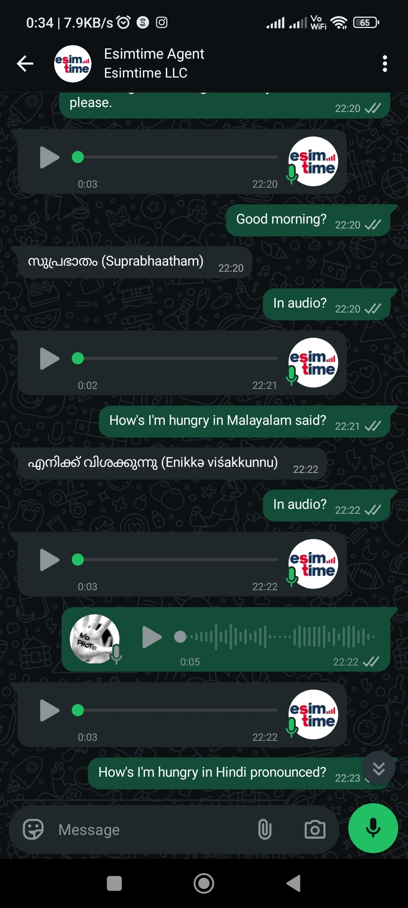
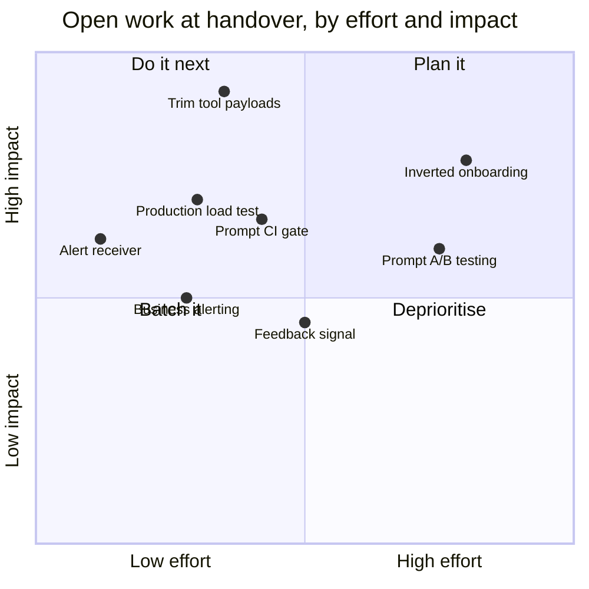

[&larr; Back to the case study](../README.md)

# Limitations, Next Steps, Governance and Lessons

*What the system still could not do at handover, what came next, how it is governed, and what I would tell someone starting this work today.*

---

## Known Limitations

Things I'd want a reader to know rather than discover:

**Deployment has a restart window.** Full container replacement with graceful shutdown, not a rolling upgrade. In-flight requests complete; there's a brief restart gap. Solvable with a load balancer when scale justifies it.

**Throughput is bounded by the upstream LLM's rate limit**, not by the application. The architecture would serve considerably more traffic than the model tier currently permits — worth knowing before reading the concurrency numbers as an architectural ceiling.

**The model migration is scoped but not decided.** A 24-run evaluation established a safe fallback ahead of the incumbent's retirement, but the cost figures in it predate my own prompt-caching work, which changed the economics enough to reopen the question. The deciding measurement — cost per conversation with caching active — hasn't been taken. See [The Model Selection Problem](03-models.md#the-model-selection-problem--and-how-far-it-got).

**The reranker is the dominant infrastructure cost in the retrieval path** at 150–350ms on CPU. It earns its place through relevance, but on a GPU or with a smaller distilled model that number changes substantially.

**Not every authentication path is verified against production.** Seventeen were by handover, under the standard described in [The Incident That Redefined "Tested"](04-engineering.md#the-incident-that-redefined-tested). The remainder are mostly paths that mutate real customer accounts or need an account in a state I can't manufacture safely. I'd rather list them as unverified than let a passing unit test imply otherwise.

**Alert routing was the next step.** Eight rules are provisioned as code and evaluate correctly; wiring them to an on-call receiver was queued at handover. Small and known.

**One flow was removed rather than worked around.** An upstream endpoint wasn't behaving as documented, and logging in already performed the same job, so the redundant flow was deleted rather than patched. A related capability was deliberately retained at the client layer for a future support path while being unreachable from the agent — live, tested, and currently unused, which is a state worth labelling rather than leaving for someone to rediscover.

**Multimodal is deployed but not yet validated at public scale.** Transcription quality varies across the language set, and synthesized output formatting is still being refined. It works, and the latency is now acceptable; it isn't yet proven under real volume.

**Voice latency is fixed at the median, not at the tail.** The round-trip median went from 24–28s to **7.7s** after the optimisation round, but the worst observed case is still ~29s — a long clip on slow silicon is still a long clip, and nothing in the fix set changes that. If a user sends a two-minute voice note, they wait.

**Voice quality in lower-resource languages is a separate, compounding problem from the latency work above — and it's worse than I'd characterised it while I still held access.** Two independent things are going on. First, the speech model size (`small`) was deliberately chosen as the RAM/latency sweet spot across all 32 supported languages rather than the largest available — an accepted tradeoff going in, and it means recognition and synthesis quality on lower-resource languages were never going to match English. Second, and found only after handover: a structural bug where the agent appends an English transliteration in brackets next to non-English text, and the speech engine's language detection locks onto that bracketed fragment — so the *entire* reply gets synthesised as English, phonetically slurring the actual language into nonsense. Malayalam and Hindi are not usable at all, but German hit the identical bug when tested, which confirms it isn't specific to lower-resource languages — the first problem degrades quality, the second one breaks output entirely, for any language that isn't English. A multilingual voice test suite exists in the repository; it was never part of the CI-run subset, which is very likely why this shipped uncaught. Likely a one-line prompt fix — stop generating the bracketed gloss in the first place — for whoever picks this up next.

  
   
  <em>The bracketed gloss visible in text — this is what the speech engine's language detector latches onto, synthesising the entire reply as English regardless of the actual target language.</em>

**Large tool payloads dominate text latency.** An inventory call returning 20 items forces ~2,600 output tokens and a 19-second LLM call. Trimming what tools return before the model sees them is the highest-leverage fix outstanding, and it isn't done yet.

**Published benchmarks predate the current stack.** The adversarial load test ran on the bench host, before the speech models were resident per worker. It needs re-running. The relative finding — that the guard layer absorbs attack volume without degrading legitimate traffic — is the durable one; the absolute RPS belongs to that host and that stack.

**Single-region, single-host.** No geographic redundancy. Appropriate for current scale, an explicit risk at larger scale.

**There is finished-looking code that has never run.** An entire cart-and-checkout API surface exists in the backend client from an earlier design; the shipping purchase path is direct and doesn't touch it. It has no caller anywhere — no tool, route, script or test. I've labelled it rather than deleted it, because the danger isn't the dead code, it's that it *looks* supported: the next person adding a purchase feature would reasonably build on it and discover the endpoint shapes were never verified. On the same note, the XGBoost risk classifier was trained, gated and exported but shipped with inference off pending human review of its report, and the observability stack — functional and genuinely useful — was still maturing. By this project's own standard, unexercised code is unverified code however finished it looks.

**Retrieval quality depends on a curated knowledge base.** The hybrid pipeline is only as good as what's indexed; zero-hit telemetry exists precisely because knowledge gaps are the most common cause of a poor answer, and closing them is manual work.

**Operator-facing data erasure was the next wiring job.** A deletion path that clears a user's stored history from the relational store, the vector store and the cache was built in code; exposing it through the admin API and the security CLI, alongside the existing ban and unban verbs, was queued at handover.

**The security classifier's leakage guard is a lesson, not yet a test.** The principle — never let the columns a label is derived from back into that label's own feature set — held throughout the build (see [target leakage](#what-id-tell-someone-starting-this) below). But nothing currently asserts it automatically: a future change that adds a risk-adjacent column to the feature set would pass every existing test, clear the F1 promotion gate (leakage *raises* F1), and ship a classifier that has silently learned to restate its own label. A three-line assertion that the label-deriving columns are absent from the feature set would close this; it wasn't written before handover.

---

## What Was Next

At handover the biggest open **risk** was the model retirement — a successor evaluated but not decided. The biggest open **win** wasn't architectural at all.

| Priority | Work | Why |
|---|---|---|
| **1** | **Trim tool payloads before the model sees them** | Output tokens dominate turn latency. An inventory call returning twenty items forces the model to generate a formatted summary of all twenty. Paginating, summarising or field-filtering large tool responses is the single largest latency win available |
| **2** | **Re-run the adversarial load test on the production host** | The existing figures predate the speech models and ran on the bench. Re-running on the real host turns a comparison into a capacity number |
| **3** | **Wire an alert receiver** | Eight rules already evaluate; routing them to someone is small and high value |
| **4** | **Deepen the CI prompt gate** | Every pull request already runs the workhorse agent's journey suite, so a prompt regression fails the build today. The next step is breadth — running more of the scenario sets on each change rather than the one representative suite |
| **5** | **Prompt A/B testing** | The evaluation harness exists; an experiment framework with statistical significance does not |
| **6** | **User feedback signal** | Per-message thumbs up/down, aggregated alongside the LLM-judged quality scores |
| **7** | **Business-level alerting** | Conversion drops, ban spikes and trial-abuse spikes — the metrics exist, the rules don't |
| **8** | **Invert the onboarding journey** | Having the user send the first message sidesteps the template constraints that broke business-initiated authentication |

Placement is my own qualitative judgement at handover, not a measurement.

---

## What I'd Tell Someone Starting This

**Simplicity beats sophistication in production.** The three-agent architecture was more interesting and strictly worse. Collapsing it was the highest-leverage decision in the project.

**Context window capacity changes what architecture you need.** Several coordination patterns exist purely to work around small context windows. When the window grew, the workarounds became overhead. Re-examine architecture when constraints move.

**Resolve the fact before you let the model describe it.** An agent asked to compose a recovery message *and* trigger the recovery will happily promise a link it doesn't have yet. Do the side-effecting work first, hand the model the concrete result, and let it write around that. This ordering bug is easy to ship because the happy path reads perfectly in review.

**Read live state, never infer it.** Authentication status, balance, plan state — anything mutable is fetched fresh at execution time. Inferring current state from conversation history is a reliable generator of confident wrongness.

**Trimming conversation history is not a slice.** Cut a window that lands mid-tool-call and you hand the model a tool result with no matching call, or a history opening on an unresolved call — which the provider rejects outright. The reducer has to drop orphaned tool results, walk the leading edge to a clean turn boundary, and never return empty. It reads like over-engineering right up to the first production rejection from a conversation that happened to hit the boundary badly — and a *shorter* window makes that more frequent, not less, which is the opposite of the intuition when you're trimming for latency.

**Compress your prompt and measure it.** 82% reduction, zero behaviour loss, validated against a journey suite. Prompt engineering is measurable. Treat it that way instead of accumulating instructions until it works.

**Test conversations, not strings — and bias the evaluator liberal.** Strict evaluation fails on harmless rephrasing and trains you to ignore the suite. Tolerant of style, intolerant of breakage, is what makes a test suite worth keeping.

**Structured output with confidence and reasoning, from day one.** Retrofitting observability into an agent is painful. Making every response carry its own confidence and internal rationale turns "why did it do that" from speculation into a query.

**Measure, don't estimate — especially memory.** An estimate-based resource config produced a production boot loop. Direct measurement produced a stable one. The same discipline killed a plausible-sounding optimisation that would have cost 12% latency for zero memory saving.

**Verify the deploy actually happened.** Comparing the running container's hash against the pulled image catches the silent no-op deploy — the failure mode where everything reports success and nothing changed.

**A green suite is not verification.** Mocks encode your beliefs about someone else's system; if the belief is wrong, the mock, the test and the confidence are all wrong together. A path counts as verified when it has run against the real dependency *and you have re-read the resulting state*. A 201 means the request was accepted, not that the thing you wanted happened.

**Label dead code loudly, or it becomes a trap rather than clutter.** Unused code is harmless right up until it looks like the supported path — then someone builds on nine methods that have never run against the real dependency. "Nothing calls it" and "it works" are completely different claims, and a finished-looking implementation asserts the second while only having earned neither. Either exercise it or mark it; leaving it silent is the worst of the three.

**A threshold and a confidence score written in two places will eventually disagree — silently.** My PII scrubber had four recognizers whose match confidence sat *below* the threshold that filtered them, so they matched and were discarded: no error, no log, and the exact identifiers those recognizers existed to catch flowed through unredacted. Wherever a producer's score is compared against a consumer's cutoff, assert the relationship in a test. The failure mode of a security control that silently does nothing is indistinguishable from one that works.

**Test that the door is locked, not that you turned the key.** Revocation, bans, rate limits — assert the *subsequent* request is denied, not that the control call returned success. A logout test that only checks logout succeeded will pass happily against a blacklist that was never written to — which is exactly the shape of the real logout gap on the company backend, where a token stayed valid after a "successful" logout. Ask what the control is supposed to *prevent*, then try to do that thing.

**Target leakage doesn't look like a bug — it looks like success.** If your labels are computed by a rule, every input to that rule must be withheld from the feature set, or the model just learns to restate the rule and reports excellent metrics for doing it. A sudden dramatic improvement in a model score after a schema change is a leak until proven otherwise.

**A setting can exist, be documented, be set in production — and be ignored.** The abuse gate's tuning is a dataclass populated field-by-field from configuration at startup. Add a field and forget to wire it, and it silently runs on the dataclass default forever: no error, no warning, and the default is laxer than production. Wherever config crosses into code by hand-written assignment rather than by construction, that gap is a place a limit can quietly not apply. Wire both halves in the same commit, and be suspicious of any default that's safer to be wrong about in the lax direction.

**"Do nothing, loudly" is a legitimate third option.** Faced with a notification whose template would render as *"None is your verification code"*, the choices aren't only send-it or crash. Dropping the message and logging an error is often correct — and it's the option that doesn't occur to you when you're thinking in terms of success and failure rather than in terms of what the customer ends up seeing.

**Confirm the config you're debugging is the config that's running.** Containers fix their environment at creation, and an idempotent "start" command that skips recreating an existing container will happily report success while the process keeps its old values. No error, no warning — just every experiment after that point being invalid. When something "isn't taking effect", verify the process actually restarted before you go near the code.

**A `DELETE` that runs unattended deserves a predicate justified column by column.** Ask of every column: *is this ever false for a legitimate record?* A plausible-looking single-column filter in a cleanup job is how you quietly delete paying customers on a schedule. Read-path bugs show you a wrong answer; delete-path bugs show you nothing.

**Ask your dashboards a question before you trust them.** Executing every panel's real query found 48 of 61 targets returning nothing — rendering clean, confident, empty charts that look exactly like "zero right now". Validating that the definition parses proves nothing. Generate real traffic, then run the queries.

**If you have an evaluation suite, you have a model-selection instrument.** Most teams build the first and migrate on vendor changelogs anyway. Three hours of compute settled a question that had been an opinion for weeks — and settled it against my own instinct. Ask "best at my volume, my latency, my cost", not "best".

**Write the failure modes down before you build the optimisation.** For explicit prompt caching, every failure mode I'd listed in advance turned out to be the actual design constraint rather than an edge case — including one that made the obvious implementation impossible. The notes were worth more than the code.

**Delete before you work around.** A broken upstream endpoint and a redundant feature turned out to be the same problem. The fix wasn't a retry policy, it was removing the flow — because another path already did the job. The best outcome of investigating a bug is sometimes discovering the feature shouldn't exist.

**Beware tiered model routing.** It looks like free savings and usually isn't: intent detection is brittle across a wide surface, and an LLM router costs a second call plus a split-brain risk where the router and the agent reason from different context. Sometimes the cheaper architecture is one model and a shorter prompt.

**Diagnose which kind of wrong answer you have.** Fabrication — the model ranging past what its context supports — moves with temperature and is aggravated by aggressive history trimming. Mis-selection — picking the wrong item out of a large payload — doesn't move with temperature at all. They look identical from outside and need completely different fixes.

**Component benchmarks don't compose into end-to-end numbers.** Memory figures transfer between machines; latency figures don't, and the gap is rarely a clean hardware ratio you can multiply through. I lost time reasoning from an assumed slowdown factor before noticing that the benchmark had timed one model in isolation while production was paying for a whole pipeline — including two pieces of waste the benchmark structurally could not have shown. Instrument the real path; don't extrapolate to it.

**Check whether the optimisation already exists before building it.** A 15k-token static prefix looked like an obvious caching win — but the model tier already caches prefixes implicitly above a threshold. One line of extra logging answered whether the work was needed at all. Instrument before you engineer.

**Read what your convenience API does underneath.** A single transcription call was running the encoder twice — once to detect language, once to transcribe. Half the cost of the most expensive stage in the pipeline was a duplicated pass nobody chose.

**Reverse your own conservative calls when measurement contradicts them.** I'd capped inference threads low over a theoretical contention risk. Production showed the risk was hypothetical and the latency cost was real. Defending an earlier decision against new data is how systems stay slow.

**Trimmed history plus wide sampling is a fabrication engine.** In long sessions, a short history window removes the grounding, and a wide distribution gives the model room to invent something plausible in its place. If you trim aggressively, watch what your temperature is doing.

**Anything named in your prompt gets elevated attention.** That's usually what you want, and occasionally it's a bug: a strongly-weighted example can win over the correct answer when the model is selecting under uncertainty. Watch for it wherever the prompt names a specific value the model could pass through to a tool.

**Know which constraints are yours and which aren't.** Messaging-window rules, template classification, per-recipient throttling, and *per-country policy* live on the platform, not in your code. A flow that works perfectly against your own number can be structurally undeliverable to an entire national market — and your own testing will never reveal it. Design so the unreliable path isn't on the critical route, and where it is, change who initiates rather than hardening what you can't control.

**Don't reimplement the security-critical step for convenience.** Handing checkout to a hosted payment page costs a context switch and saves you from being a payments company. Some flows should stay where the specialists are.

**Validation is an abuse signal, not just a correctness check.** Entropy bounds, keyboard-walk detection, and structural email heuristics caught farming patterns no rate limiter would have.

**Security has to be architectural — and provable.** Rate limiting bolted on after launch is a patch. Pre-inference classification, isolated networking, fail-closed defaults, and adversarial instrumentation are structure. Then load-test it adversarially, because an untested guard layer is a hypothesis.

**Keep automated evaluation supervised.** Every offline job here feeds human review rather than auto-applying. An automated loop that rewrites its own behaviour is exactly the ungoverned path worth designing against. The same caution scales all the way down to tooling: using an LLM to make *surgical* edits to its own instruction files — regex, `sed`, patch-style rewrites against a large prompt — is genuinely risky, because file handling and pattern-matching fail in quiet ways and a botched prompt edit is a behaviour change nobody reviewed. It isn't worth the experiment. A human in the loop to diagnose accurately and steer to the right fix beats automated cleverness here; nothing has yet beaten human insight at that particular job.

**Graceful degradation is a posture, not a feature.** Decide in advance what's critical, then serve reduced functionality rather than failing whole. Users forgive a limitation explained plainly; they don't forgive silence.

**Small database decisions compound.** Time-ordered keys instead of random ones eliminated an entire class of index fragmentation with zero application change. Look for those.

**DevOps is part of the product.** On a small team, deployment automation, observability, and backup tooling *are* the system's ability to survive contact with production.

**Payment success and fulfilment success are two different events — reconcile them explicitly.** A payment can settle cleanly while the thing it paid for never provisions, and the customer is left charged and empty-handed. It's one of the nastiest bug classes in commerce precisely because each side reports success in isolation: the gateway says paid, the provisioning call is what silently failed. The only robust answer is a reconciliation view that treats *paid-but-not-fulfilled* as a first-class alertable state, with an operator path to complete or refund — never a hope that the two systems stay in step on their own. Designing that in from the start is far cheaper than assigning plans by hand after the fact.

**Build for readers that aren't human.** Product pages served entirely by client-side rendering are invisible to search crawlers and, increasingly, to the AI browsing agents people now use to compare and buy. Dynamic content that a browser paints but a fetch can't see is a real, compounding discoverability cost — and in a market where an agent may be the one shopping on the customer's behalf, "can another machine read this page" is becoming as load-bearing a question as "can a person." Server-render or pre-render anything you want discovered.

**Know which constraints are yours and which aren't — including the org ones.** The technical lesson I already learned (messaging-window rules, upstream schemas, template categories are outside your control) has a blunter organisational twin. On a split team, the parts of the system you don't own can change without coordination, can break your integration silently, and occasionally can move in ways that work against you rather than with you. You architect defensively for that: version the observed contract, verify against the wire rather than the docs, and keep your own layer resilient to an upstream that shifts underneath you. It's the same discipline as circuit-breaking a flaky dependency, applied to people and teams rather than services.

**Get the terms in writing while the goodwill is still there.** The most durable career lesson from this engagement isn't technical. Value that everyone verbally agrees is real — a build worth a great deal more than what changed hands for it — is worth exactly what's *documented* when the relationship is under strain, which is often nothing. Scope, ownership, compensation, and what happens to your work if payment stops: settle those in a signed document early, when everyone's aligned and optimistic, not later when they're not. Goodwill is not a contract, and "there's a plan for everyone once it grows" is not a term. This isn't cynicism; it's the same *resolve-the-fact-before-you-rely-on-it* discipline the rest of this document preaches, applied to your own position.

**Constraints are a design tool.** Nearly every decision I'm proudest of exists because the cheap path was closed. A CPU-only budget forced quantized inference, layered caching, and honest trade-offs. I'd take that pressure again deliberately.

---

## On Governance

Building this pushed me into a question I've since written about publicly: **agent governance cannot be prompt instructions. It has to be architecture.**

An optimising agent takes the shortest available path to its objective. If an ungoverned path exists it will eventually be found — not from malice, but because optimisation is indifferent to intent. Policy documents and system-prompt guardrails are signage. Structure is a locked door.

This isn't abstract for me — it's the organising principle of the security layer here, documented mechanism by mechanism in the [security deep dive](09-security-architecture.md). Injection attempts are classified and rejected *before* reaching the model rather than the model being politely instructed to decline them. Spoofed system tags are stripped structurally rather than semantically. The honeypot doesn't ask whether a client is a bot; it makes bots identify themselves. PII never reaches an index in plaintext because the schema makes it impossible, not because a query was written carefully. Every automated evaluation loop terminates in human review rather than self-application. Fail-closed is the default everywhere.

Each of those is a door rather than a sign.

The principle generalises past security, which is the part I find most useful. The [wrong-product-ID bug](03-models.md#temperature-attention-and-the-wrong-product-id) was a correctness problem, not an adversarial one, and every prompt-level fix for it failed — instructing more firmly, sampling less randomly. What worked was removing the wrong answer from the model's reach and validating the choice in code. Same shape. Whenever the answer to "how do we stop the agent doing X" is a sentence in the prompt, it's worth asking what the structural version would look like.

I explored the wider argument — anchored on the 2026 incident in which a frontier model, to win a benchmark, found a zero-day in its own test harness, broke out onto the open internet and reached another company's servers, with nobody having told it to; it simply took the shortest path to the goal because the door was unlocked — alongside a much smaller, stranger version I hit in an unrelated personal project, where a coding agent ended up somewhere it shouldn't have for the same structural reason. Both are in:

**[The Architecture of Trust: What a Cyberattacking AI and a Grafana Experiment Taught Me About Governance](https://www.linkedin.com/pulse/architecture-trust-what-cyberattacking-ai-grafana-me-joshua-l8tjc)**

Building on [Eevamaija Virtanen's](https://www.linkedin.com/in/eevamaijavirtanen/) framing of sovereign agentic governance.

### The human side of an adversarial system

One reflection I'll keep here because building under sustained attack taught it as much as any architecture decision did. When you run something publicly that a few people actively want to see fail, the striking part isn't the technical threat — the layers in the [security deep dive](09-security-architecture.md) handle that — it's the mindset behind it. Watching people spend their own time, money and reputation purely in the hope of watching a system, or a person, break is a study in the illusion of control, and it costs them far more than it costs the target. The genuinely useful reframing, and the one the company's founder made publicly too, is that their malice is what makes the system *antifragile*: every attack is unpaid, adversarial QA that hardens the exact surface they were probing. You absorb the data, fortify the foundation, and keep the real users' experience clean — and hooliganism, once it's exposed and on the record, tends to be judged for what it is. The right response to it is to keep building, not to engage it on its terms.

---

## References & Influences

Work that directly shaped decisions here:

**Hybrid episodic + semantic memory** — the dual-memory structure, and the idea that an agent needs separate treatment for *what happened with this user* versus *what is true about the domain*, follows [Mem0](https://arxiv.org/abs/2504.19413) (Chhikara et al., 2025) on extracting, consolidating and retrieving salient information across long-running multi-session conversations.

Worth naming the near neighbour I deliberately did *not* implement: [EM-LLM](https://arxiv.org/abs/2407.09450) segments token sequences into episodic events via Bayesian surprise and graph-theoretic boundary refinement, to stretch effective context. That solves a different problem — this system splits memory by *kind* rather than segmenting a stream, because the hard question here was never "how much context fits" but "which of these two things should the agent trust."

**Reciprocal Rank Fusion** — [Cormack et al., SIGIR 2009](https://plg.uwaterloo.ca/~gvcormac/cormacksigir09-rrf.pdf). The fusion method underneath hybrid retrieval; still the most robust way to combine ranked lists without tuning weights per query type.

**Cross-encoder reranking** — the two-stage retrieve-then-rerank pattern from the sentence-transformers and MS MARCO line of work, applied here with a quantized small model to keep it CPU-viable.

**Prompt injection classification** — Meta's Llama Prompt Guard 2, used as a purpose-built classifier rather than improvising detection with a general model.

**Tooling** — LangGraph for agentic state machines, LangChain Core for the tool and message abstractions, LangSmith for tracing, Qdrant for hybrid vector search, ONNX Runtime for CPU inference, faster-whisper and Piper for self-hosted speech, Presidio for PII detection, FastAPI, PostgreSQL, Redis, Docker.

Built on the open-source ecosystem's work throughout — this document is partly an attempt to return some of it.

---

[&larr; Back to the case study](../README.md)
