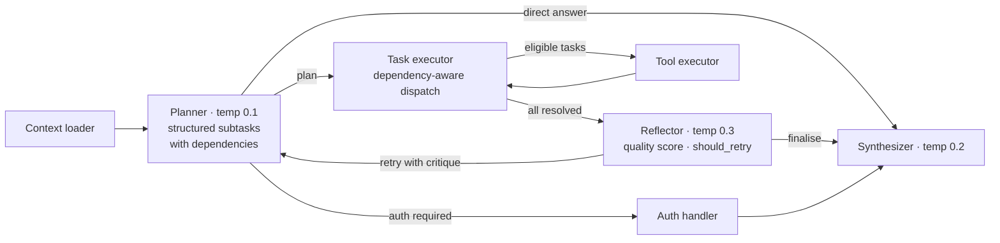
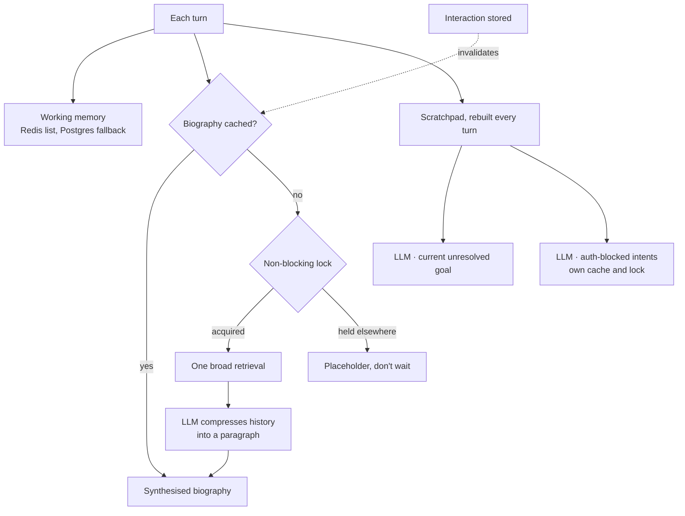

[&larr; Back to the case study](../README.md)

# Research Notes: Two Deliberate Excursions Into the State of the Art

*Supplementary, outside the seven-part case study. Both designs here are **experimental research prototypes**, built in personal time alongside the production work to study published state-of-the-art agentic techniques by implementing them. Neither was carried to a complete, tested state — each was explored as far as needed to understand the shape and the structural cost of the technique, then set aside. They're presented as concepts and design ideas others can build on, not as working systems. No source is reproduced.*

---

## Why These Exist

Everything in the main seven-part case study describes what shipped, under a real latency budget, a real cost ceiling, and real users, hardened over months. These two components sit outside that pressure entirely, and outside that timescale — each was carried only as far as a working prototype, in personal time, alongside the actual work. Neither was tuned, load-tested, or exercised against edge cases the way anything in the main case study was. What they answer is narrower and more honest than "how would this perform": *prototyped, what does the shape of this published technique actually look like, and what does it structurally cost even before any of that hardening happens?* That's a different exercise from production engineering, and it's worth reading everything below with that ceiling in mind — what follows describes each design as conceived and prototyped, not a claim that either was ever complete or reliable.

---

## I. The Hierarchical Planning Agent

A from-scratch attempt at a genuinely different agentic control pattern than the one documented in [The Agent Itself](05-architecture.md#the-agent-itself) — not a simpler version of the production agent, a structurally different one, built around explicit plan-execute-reflect-retry cycles rather than a flat reasoning-and-tool-calling loop. Prototyped as a design exploration — never completed, tuned or stress-tested, and nowhere near the rigour the shipped design went through.

### The state it carried

The graph's state object was substantially richer than the production agent's. Beyond the conversation messages, user and chat identifiers, and session data, it separately tracked: a `current_plan` (the structured output of the planning stage), a list of `subtasks` with individual status, an `execution_results` dictionary keyed by subtask, a full `reflection_history` across retry attempts, a `retry_count` against a `max_retries` ceiling, an explicit `current_phase` enum (`planning`, `executing`, `reflecting`, `responding`, `complete`), and a dedicated `auth_deferred_intent` slot for whatever the user had originally asked before authentication interrupted them. Every one of those fields existed because a distinct phase of the graph needed to read or write it — this was state modelling for a genuinely multi-stage process, not a single loop with extra bookkeeping bolted on.

### Four roles, four temperatures

Rather than one model handling the whole turn, the design partitioned reasoning across four separately configured LLM roles, each on the same base model and API but tuned differently for its job:

- **Planner** — the coldest setting (0.1), because its only output was a structured decomposition and any variance in that stage compounds through everything downstream of it. Determinism here mattered more than fluency.
- **Executor** — a middle setting (0.2), intended for tool-call construction. In the prototype the planner's structured subtasks already carried tool names and arguments, so this role was configured but never given work of its own — an open design question the exploration didn't resolve, and arguably a hint that planning and execution wanted to be one step.
- **Reflector** — the warmest of the four (0.3), on the theory that critical self-assessment benefits from a wider sampling range — the same instinct documented (and later found to be double-edged) in [Temperature, Attention, and the Wrong Product ID](03-models.md#temperature-attention-and-the-wrong-product-id). This prototype predates that finding, and in hindsight its own temperature choice is a small piece of evidence for the same lesson: a *narrow* task like structured reflection scoring may not actually benefit from a *wider* distribution, and nothing in this design measured whether it did.
- **Synthesizer** — brought back down (0.2) for the final natural-language pass, once every upstream stage had already done its structured work.

### The planning stage

The planner ran with structured output enforced — a Pydantic schema requiring a plain-language statement of the user's intent, a numeric confidence score, an explicit choice of execution strategy (`sequential`, `parallel`, or `mixed`), a boolean flag for whether authentication was required, a written reasoning trace justifying the plan, an optional contingency plan for if the primary approach failed, and — the actual payload — a list of subtasks. Each subtask carried its own identifier, a plain-language description, an optional target tool name and arguments, a priority level (`critical` down to `low`), and a list of other subtask IDs it depended on.

Two shortcuts existed before the planner was even invoked: a hardcoded auth-command handler intercepted `/login email password` and `/logout` directly against the session layer, bypassing planning entirely for those two commands, and a keyword shortcut routed simple greetings straight to a canned response — a substring match that any real deployment would need to replace with a classifier, because short words like *hi* appear inside ordinary questions — an early, considerably cruder ancestor of the "consultant intelligence" behaviour that in the shipped system is handled by the model itself rather than a string match.

### Execution: a real dependency graph, walked repeatedly

The executor node didn't simply fire every subtask — on each pass it filtered the subtask list down to those with no unmet dependency (checked by confirming every listed dependency ID was marked `completed` elsewhere in the list) and no outstanding auth requirement, then branched on the plan's declared execution strategy: mark every eligible subtask `executing` and dispatch together if `parallel`, or pick the single highest-priority eligible subtask if not. If nothing was eligible and every subtask had resolved to some terminal state, the graph moved on to reflection; if the only remaining subtasks were blocked on authentication, it surfaced the login request directly instead.

Dispatch itself constructed real LangChain tool-call objects on the fly — synthesizing an `AIMessage` carrying the tool calls for whichever subtasks were currently `executing`, injecting the session's access token into the arguments of any call whose tool was known to require authentication, and running them through a standard `ToolNode`. Results were parsed back per subtask by matching each returned `ToolMessage` against the call ID that had dispatched it, and a task's status flipped to `failed` or `completed` by a simple substring check for the word "error" or "failed" in the tool's own response text.

### Reflection, and a genuine retry loop

After a full pass — every subtask completed, failed, or newly blocked — the graph handed a summary of the whole execution (each subtask's description, status, and a truncated preview of its result) to the reflector, which was asked five explicit questions: was the request fully addressed, were there errors, was the information complete and accurate, what corrections were needed, and should the whole thing be retried. The reflector's structured answer included a numeric quality score and an explicit `should_retry` boolean.

If retry was indicated — under a designed ceiling of two retries — the *specific* issues and corrections identified were folded directly into the next planning prompt as extra context — not a blind re-run, a planning pass explicitly told what went wrong last time and what to fix. That closed loop — plan, execute, critique, replan with the critique attached — is the part of this design I'd still call genuinely interesting on its own merits, independent of whether the cost justified it here.

### Confidence, all the way through

Every path out of the graph carried a confidence figure: a high default for a normal completed run, a lowered figure for a fallback response triggered by a planning failure, a middle figure for the greeting shortcut, and — when reflection had actually run — the reflector's own quality score substituted directly as the turn's final confidence. The shipped system's confidence scoring (see [The Agent Itself](05-architecture.md#the-agent-itself)) is structurally simpler — a fixed scale keyed to *where* an answer came from (direct tool data, retrieval, inference) rather than a model's live self-assessment of its own output. Simpler, and also not vulnerable to a reflector being wrong about how well the reflector thinks the turn went.

### Production instincts that never got a production system

Even as a pure research artefact, this prototype was built with real operational scaffolding: a versioned singleton pattern for agent instances (allowing, in theory, multiple configuration versions to coexist and be hot-swapped), a structured metrics-logging helper emitting per-turn execution time, success, confidence, planning-iteration count, and reflection quality as queryable fields, and a dedicated health-check routine that instantiated the agent and ran a real synthetic message through it end to end before reporting healthy. None of it was wired into the actual application's health endpoint or metrics pipeline — but the instinct to build it in from the start, even for an experiment, is consistent with everything the production system does around observability.

### The honest cost accounting

Walk a realistic case: concurrent context loading, one planning call, at least one tool-execution pass, one reflection call, and — if reflection asks for a retry — another planning-through-reflection cycle before the final synthesis call. That's three model calls on the simplest tool-using path and five or more with a single retry, for a turn a flat tool-calling loop handles in one — before counting anything a synthesised memory layer like the one below would add. Measured against [Performance](06-performance.md#performance), where the production system's actual bottleneck is squarely LLM latency and the framework overhead is negligible, this design multiplies the expensive part of the pipeline by exactly the factor you can't afford to multiply.

**What it confirms, not just what it cost.** The validated-tool-boundary approach that shipped — a whitelist, strict schema checking, a two-strike retry rule (see [The Agent Itself](05-architecture.md#the-agent-itself)) — gets a meaningful share of the reliability benefit this design's reflection loop was reaching for, and gets it *before* a bad call executes rather than critiquing it afterward. Prevention beat detection here, and this prototype is the clearest evidence available for why.

**One artefact worth naming on its own.** This design's authentication path took a password typed directly into the chat as a slash-command. Production moved decisively the other way: a short-lived earlier design that collected credentials in chat was replaced by a web-link login relay, with phantom-login intent preservation, so credentials are entered in a browser rather than a message thread (see [Phase 3](01-timeline.md#phase-3--identity-memory-hardening-novdec-2025)). A password route survives only as a fallback for when the relay can't complete. The reason is plain: asking someone to type a password into a WhatsApp thread is a trust problem before it's anything else.

---

## II. The Synthesised-Memory Design — and a More Faithful Reading of Mem0

The main case study credits [Mem0](07-reflections.md#references--influences) as the inspiration for splitting memory into *what happened with this user* versus *what is true about the domain*, and the production system implements that split via direct hybrid retrieval — episodic memory is vector-stored interaction history, pulled by search, never summarised by a model before it reaches the agent.

This research branch is a different, and in one specific respect **more literal**, reading of the same paper — prototyped, like its counterpart above, and never refined or load-tested. Mem0's actual technique isn't just "split memory by kind" — it's LLM-driven *extraction and consolidation* of salient information across sessions, not raw storage-and-retrieval of everything that happened. This design implements exactly that: episodic memory here isn't retrieved conversation fragments, it's a **model-synthesised biography**, actively consolidated by an LLM rather than assembled by a search ranking. Worth being precise about this, because it means the production system's relationship to its own cited research is *inspired by, structurally diverged from* — and this archived design is the piece that tried, at a basic level, to build the technique roughly as published, before the constraint of running at low latency and near-zero marginal cost ruled it out.

### Three constructs, three different lifecycles

**Working memory** — the raw recent transcript. Stored as a Redis list per chat, read with a cache-first strategy: a hit returns directly; a miss falls through to Postgres, reconstructs the list, and repopulates Redis via a pipelined write (delete, then push every message, then set an expiry) so the next read is served entirely from cache. Capped to a fixed maximum length throughout.

**Episodic memory** — the LLM-synthesised biography. On a cache hit, returned directly. On a miss, the design attempts a **non-blocking distributed lock** — and the non-blocking part is the interesting idea: if the lock is already held by a concurrent request doing the same synthesis, this request doesn't wait for it. It sleeps briefly, checks the cache once more in case the other request finished in the meantime, and if not, returns an explicit placeholder ("your profile is being generated") rather than blocking the turn on someone else's LLM call. The synthesis itself, when it does run, pulls relevant history via a single fixed retrieval query — deliberately broad, asking for travel patterns, recurring issues, product interests, and general personal detail in one pass — and hands that history to a model with an explicit instruction to compress it into a short biographical paragraph.

**The scratchpad** — regenerated completely fresh on *every single turn*, never cached itself. Two things happen concurrently here: a "current goal" call, prompted specifically to state only the user's most recent *unresolved* request (with an explicit worked example in the prompt: if the user got their balance and then asked about Japan, the current goal is the Japan question, not the balance one) — and a "pending intents" call, itself independently cached under its own lock, that scans the conversation for anything blocked on authentication and returns it as a structured list.

### The mechanism worth naming specifically: cache invalidation that undercuts its own cache

Every time an interaction was stored, the episodic biography cache for that user was deliberately deleted as part of the same write — the design's own logic for why is sound in isolation: a stale biography that doesn't reflect the most recent exchange is worse than no biography. But the practical effect, in an actively flowing conversation, is that the expensive synthesis call gets invalidated after nearly every turn it would otherwise have served from cache — meaning the cost this cache exists to avoid gets paid again almost immediately in exactly the conversations where a user is engaged enough to be sending frequent messages. A caching strategy whose invalidation policy fires on the event most correlated with wanting a cache hit is a specific, nameable failure mode, and this design has it in clean, isolated form.

### The part that did survive, in spirit

`invalidate_context_caches` — an explicit hook meant to be called specifically around login and logout, clearing working-memory and pending-intent caches so stale pre-authentication context could never leak into a post-authentication turn. That exact function never shipped. But the underlying discipline — that authentication state changes must actively invalidate anything cached under the old state, not passively expire — is precisely what governs the production system's real session-cache behaviour around the phantom-login and re-authentication paths documented in [Phase 3](01-timeline.md#phase-3--identity-memory-hardening-novdec-2025). The idea outlived the implementation.

Also present here, and worth flagging against the main case study's own [Known Limitations](07-reflections.md#known-limitations): a full `delete_all_user_memory` routine, wiping a user's data from the relational store, the vector store, and every relevant Redis key in one call. The production system's equivalent capability exists in code and — as documented — has no operator-facing way to trigger it. This research branch's version has the same shape and the same gap; neither ever got wired to an admin surface. Not evidence that the gap was ignored, more evidence that the idea was worth building twice and worth closing once.

### Two write-path ideas production reversed

The prototype issued each interaction's relational write and vector write concurrently, and sent conversation text to the vector store as-is. Production reversed both decisions. The vector write is spawned only after the relational write confirms, so the vector store can never hold a conversation the database doesn't; and every message is PII-scrubbed before it is embedded. Neither is visible in a demo. Both matter the first time one store fails without the other, or the first time a phone number resurfaces in a retrieved memory.

### Why it was set aside

Direct retrieval produces, as a side effect of a single search call, most of what this design spent two to three extra model calls trying to reconstruct explicitly. The "current goal" the scratchpad computed fresh every turn is, in the shipped design, simply the live conversation state already sitting in front of the agent — nothing needs to be summarised because nothing needed reconstructing in the first place. The biography this design synthesised and then invalidated almost as fast as it cached it is replaced, in production, by memory that's always current because it was never stale to begin with — it's retrieved fresh each time, not maintained as a standing artefact that can drift out of sync with what actually happened.

**The honest framing, stated plainly:** this is the more research-faithful implementation of the cited technique, and the shipped system is the more production-faithful one. Both are legitimate answers to "how should an agent remember." Only one of them runs for under $45 a month.

---

## What Carrying Both Forward Is Worth

Neither of these was a false start, and neither was a finished piece of engineering either — both stopped at the prototype stage, on purpose, once the question they were built to answer had been answered. That's the actual value of keeping research side-branches around after the decision is made — not as evidence of what didn't work, and not dressed up as more rigorous than they were, but as a documented, honestly-scoped answer to the question "what would the sophisticated version have cost, and what would it have bought," asked and answered before the simpler system shipped rather than assumed afterward.

---

[&larr; Back to the case study](../README.md)
